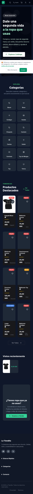
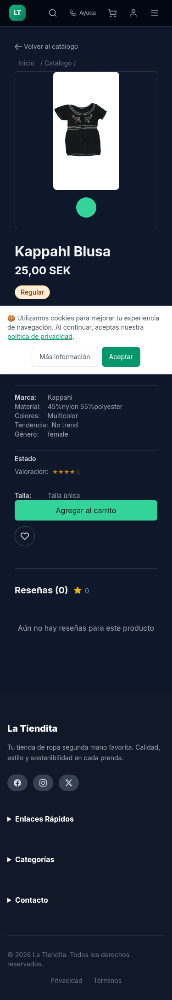
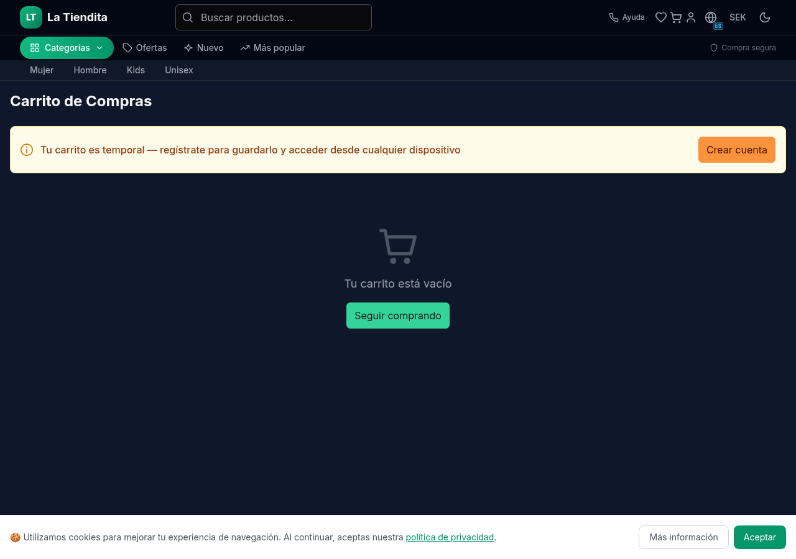
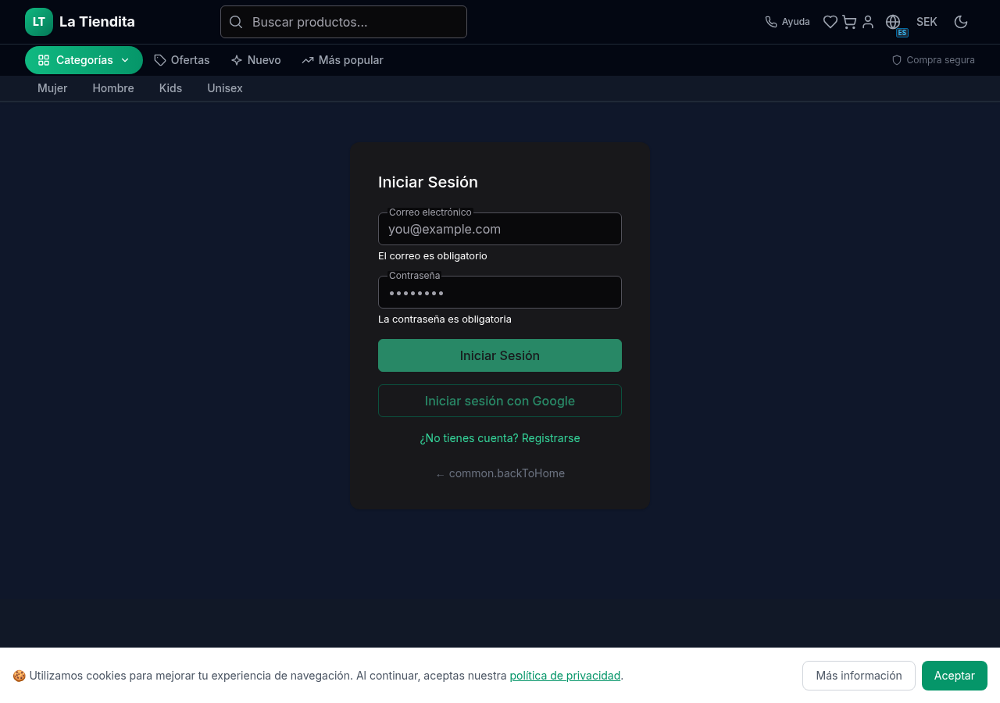
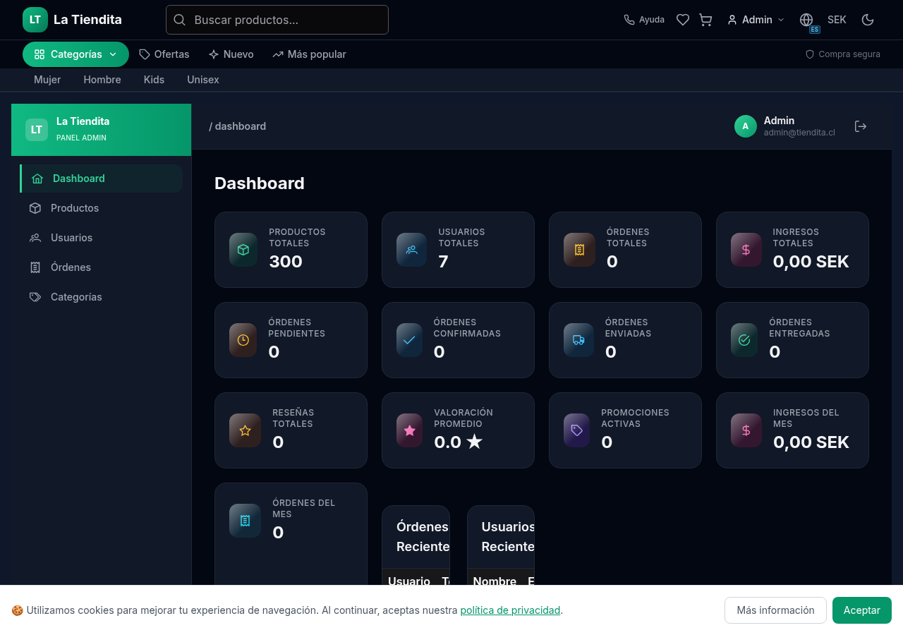
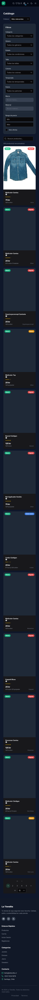

# La Tiendita — Second-Hand Clothing E-Commerce

[](https://python.org)
[](https://litestar.dev)
[](https://angular.dev)
[](https://postgresql.org)
[](https://redis.io)
[](https://docker.com)
[](LICENSE)

> Fullstack e-commerce platform for second-hand clothing — modern async Python backend + Angular SPA with complete shopping flow, payments, admin panel, and GDPR compliance.

---

## Screenshots

<table>
  <tr>
    <td></td>
    <td></td>
  </tr>
  <tr>
    <td colspan="2" align="center"><em>Homepage — light mode desktop & mobile responsive</em></td>
  </tr>
  <tr>
    <td></td>
    <td></td>
  </tr>
  <tr>
    <td colspan="2" align="center"><em>Product catalog with filters + product detail (dark mode, mobile)</em></td>
  </tr>
  <tr>
    <td></td>
    <td></td>
  </tr>
  <tr>
    <td colspan="2" align="center"><em>Cart with guest warning + authentication</em></td>
  </tr>
  <tr>
    <td></td>
    <td></td>
  </tr>
  <tr>
    <td colspan="2" align="center"><em>Admin panel + mobile product listing</em></td>
  </tr>
</table>

---

## Architecture

```
┌─────────────┐     ┌──────────────────────────────────────┐
│   Browser   │────▶│         Nginx Reverse Proxy          │
│  (Angular   │     │   Port 80 → frontend /api → backend  │
│   SPA 22)   │     └──────────────────────────────────────┘
└─────────────┘                          │
         │                               │
         ▼                               ▼
┌──────────────────┐     ┌──────────────────────────────┐
│   Angular SPA    │     │      Litestar API (Python)    │
│  PrimeNG UI      │     │  Controllers → Services → Repo│
│  RxJS + Signals  │     │  JWT Auth · 2FA · Audit Log   │
│  ngx-translate   │     │  Cache-Aside · CQRS Queries   │
│  3 languages     │     │  Stripe Payments · Rate Limit  │
└──────────────────┘     └──────────────────────────────┘
                                    │           │
                          ┌─────────┘           └──────────┐
                          ▼                                 ▼
                  ┌──────────────┐                ┌──────────────┐
                  │  PostgreSQL  │                │   Redis 7    │
                  │  16 Alpine   │                │  Cache + ARQ │
                  │  + Alembic   │                │   LRU 512MB  │
                  └──────────────┘                └──────────────┘
                                                       │
                                                       ▼
                                               ┌──────────────┐
                                               │  ARQ Worker   │
                                               │  Background   │
                                               │  Jobs (email, │
                                               │  images)      │
                                               └──────────────┘
```

---

## Features

### 🛍️ Customer Experience
- Product catalog with **FTS search** (PostgreSQL full-text) + multi-criteria **filtering** (category, gender, size, material, condition, price range)
- Product detail with **variant management** (color, material, condition), image gallery, user reviews & ratings
- **Shopping cart** with guest→user merge on login, guest warning bar
- **Checkout flow** with Stripe payments, shipping method selection, stock reservation
- **Wishlist** + recently viewed products
- **3 languages**: Spanish, English, Swedish (ngx-translate)

### 🔐 Auth & Security
- **JWT auth** with access/refresh token rotation, **2FA TOTP** (admin only)
- **OAuth stubs** (Google) ready for social login
- **Rate limiting** per endpoint + **Sentry error tracking**
- **GDPR compliance**: granular cookie consent (essential/functional/analytics), account deletion with cascade, data export (portability Art. 20), marketing consent toggle, session expiration warning

### ⚙️ Admin Panel
- **Dashboard** with revenue/monthly stats, recent orders/users/products/promotions
- **Product CRUD** with translations (es/en/sv), variants, image upload
- **User management** — list, search, role change, edit profile, delete with cascade
- **Category CRUD** with translations
- **Order management** — status updates, invoice download
- **Promotion/variant management**

### 🏗️ Backend Architecture
- **Clean/Hexagonal** layering: `controllers → services → repositories → models`
- **Repository pattern** for data access, **DTO schemas** (Pydantic v2)
- **CQRS-inspired** read/query separation for complex queries
- **Event bus** for cross-cutting concerns (audit log, cache invalidation)
- **Cache-aside** with Redis configurable TTL per resource
- **Background jobs** via ARQ (async Redis queue) — image processing, email dispatch
- **Alembic migrations** on startup, **health probes** (liveness/readiness)
- **Comprehensive audit logging** with actor/action/entity trail

### 📦 Infrastructure
- **Docker Compose** for both dev and production (multi-stage builds)
- **Nginx** reverse proxy, separate **worker** container, Redis-backed queue
- **CI/CD** via GitHub Actions

---

## Tech Stack

| Layer | Technology |
|-------|-----------|
| **API** | [Litestar 2.x](https://litestar.dev) (async Python) — chosen over FastAPI for its integrated DI system, declarative OpenAPI generation, and native guards |
| **Database** | PostgreSQL 16 Alpine with SQLAlchemy 2.x async + Alembic migrations |
| **Cache & Queue** | Redis 7 Alpine — cache-aside pattern with LRU eviction + ARQ job queue |
| **Frontend** | Angular 22 with signals, RxJS, standalone components |
| **UI** | PrimeNG — richer form components, built-in accessibility, consistent design system |
| **Styling** | Tailwind CSS v3 + PrimeUI themes |
| **Payments** | Stripe (test mode) |
| **Background Jobs** | ARQ — chosen over Celery for native async/await, Redis-native, zero extra dependencies |
| **Auth** | JWT (python-jose) + PyOTP for 2FA |
| **Infra** | Docker multi-stage, Nginx, GitHub Actions CI |

---

## Key Decisions

### Why Litestar over FastAPI?
FastAPI is the standard choice for async Python, but Litestar's native DI scoping (singleton/request/connection), declarative OpenAPI via Python types, and guard-based auth integrate more cleanly with JWT validation. The result: less boilerplate for dependency injection and cleaner controller code.

### Why PrimeNG over Angular Material?
Material excels at dashboards, but PrimeNG provides richer form components (multi-select, chips, file upload with preview), better table features (sorting, filtering, responsive), and the complete PrimeIcons icon set. Built-in accessibility and dark mode support sealed the choice.

### Why ARQ over Celery?
This codebase is async-first (Litestar + SQLAlchemy async). Celery requires bridging sync/async with a separate thread pool. ARQ runs natively inside the asyncio event loop, needs only Redis (no RabbitMQ), and worker code uses the same async patterns as the API. For this deployment size, simplicity wins.

### Why CQRS Queries?
Several screens (admin dashboard, product catalog filtering) need complex JOINs that don't map cleanly to the standard model→repository pattern. The approach here: commands flow through services with business logic, while complex queries use direct SQL with typed result models. No event sourcing, no message bus — just enough CQRS to keep queries fast without over-engineering.

---

## Quick Start

```bash
# Prerequisites: Docker, Node.js 24+, Python 3.14+

# 1. Clone and enter
git clone git@github.com:your-username/tiendavirtual.git
cd TiendaVirtual

# 2. Copy environment config
cp .env.example .env
# Edit .env with your own values (defaults work for local dev)

# 3. Start all services (PostgreSQL + Redis + API + Frontend)
docker compose up
```

Services:
| Service | URL | Defaults |
|---------|-----|----------|
| PostgreSQL | `localhost:5432` | `postgres / postgres` (db: `tiendita_dev`) |
| Redis | `localhost:6379` | — |
| API | `http://localhost:8000` | OpenAPI at `/schema` |
| Frontend | `http://localhost:4200` | — |

**Manual run without Docker:**
```bash
# Backend
cd backend && python -m venv .venv && source .venv/bin/activate
pip install -e . && uvicorn app.main:app --reload --port 8000

# Frontend
cd frontend && pnpm install && pnpm dev
```

---

## Testing

```bash
# Backend (30 test files)
cd backend && python -m pytest

# Frontend (55 spec files)
cd frontend && pnpm test

# E2E (Playwright)
cd frontend && pnpm test:e2e
```

| Layer | Count | Status |
|-------|-------|--------|
| Backend unit | 30 files | ✅ 235 passed (28 env-dependent skipped) |
| Frontend component | 55 spec files | ✅ Configured |
| E2E (Playwright) | — | ✅ Configured |

---

## Production Deploy

```bash
# Build and start the full production stack
docker compose -f docker-compose.yml -f docker-compose.prod.yml up -d
```

Production runs on **port 80** via nginx with:
- Compiled Angular SPA (nginx:alpine)
- Litestar API (python:3.14-slim) with uvicorn
- PostgreSQL 16 Alpine with persistent volume
- Redis 7 Alpine with persistent data
- ARQ background worker
- Persistent uploads volume

---

## Project Structure

```
backend/
├── app/
│   ├── controllers/     # HTTP layer (routes, validation, response)
│   ├── services/        # Business logic
│   ├── repositories/    # Data access
│   ├── models/          # SQLAlchemy ORM models
│   ├── schemas/         # Pydantic v2 DTOs
│   ├── guards/          # Auth guards (JWT, admin, rate limit)
│   ├── middleware/      # Request/response middleware
│   ├── core/            # Config, events, cache, handlers
│   └── utils/           # Helpers
├── migrations/          # Alembic versions
└── tests/               # 30 test files

frontend/
├── src/app/
│   ├── core/            # Services, guards, interceptors, models
│   ├── features/        # Feature modules (11 features)
│   ├── shared/          # Shared components (product-card, pagination, etc.)
│   ├── layout/          # Header, footer, admin-layout
│   └── assets/          # i18n (es/en/sv), images, icons
└── ...
```

---

## License

MIT — see [LICENSE](LICENSE).

---

*Built by [Alejandro Martínez](https://github.com/sushirowsky) · Stockholm, Sweden*
