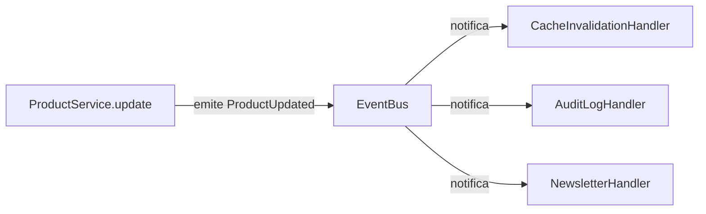
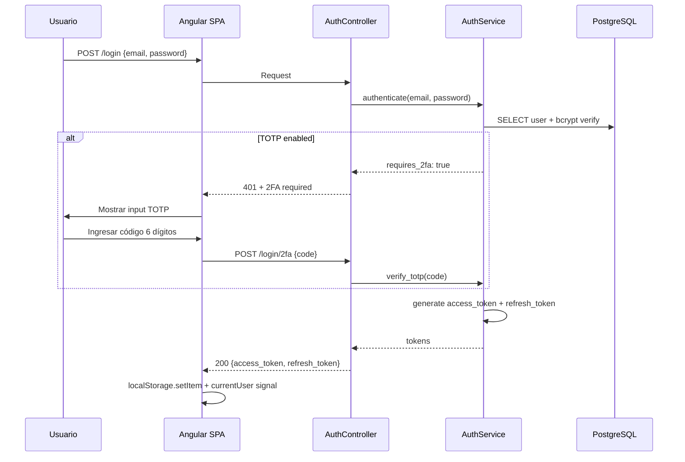
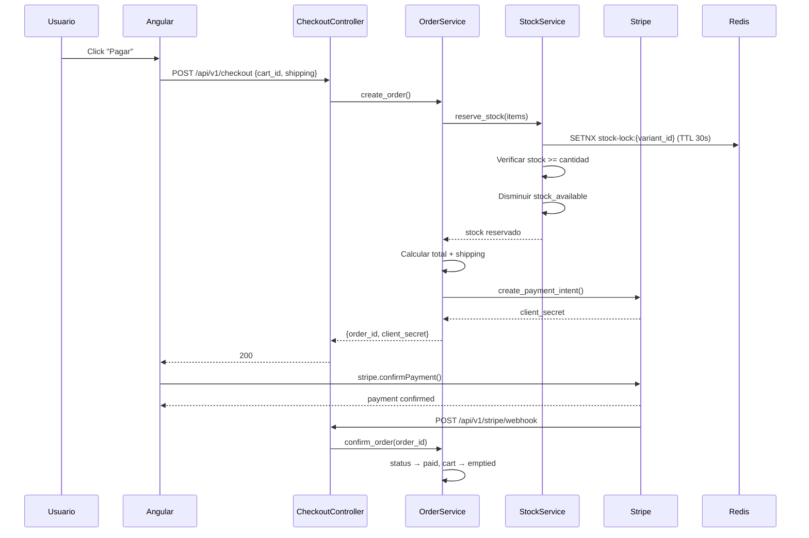
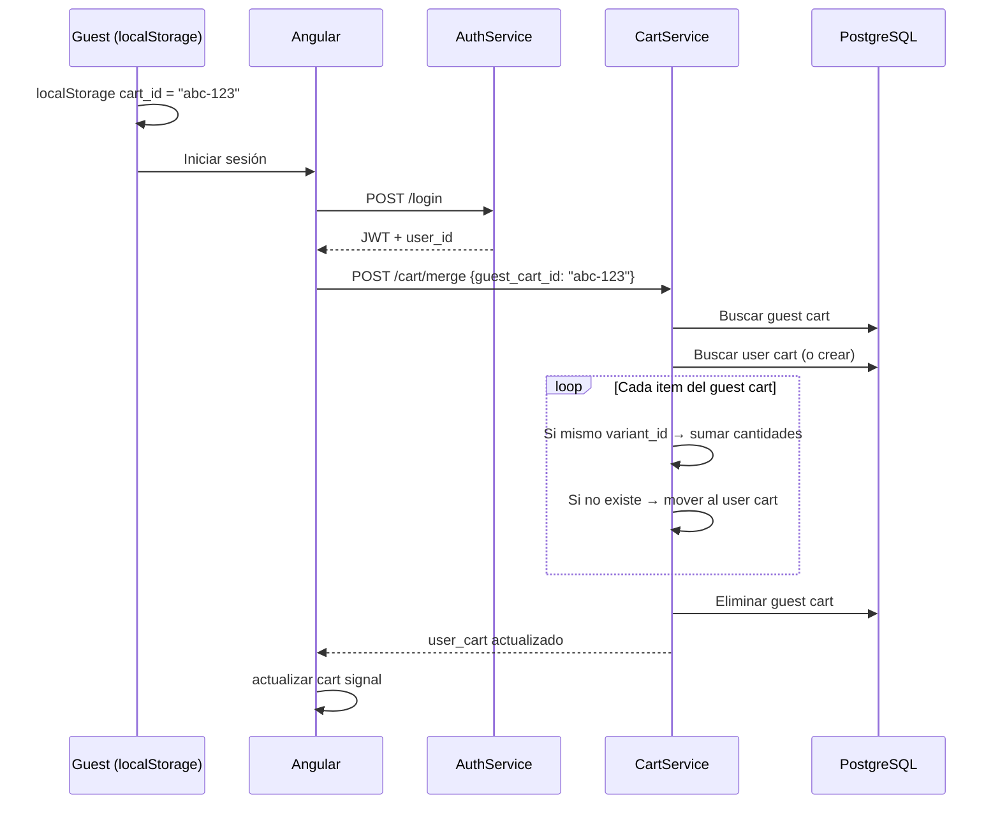

# La Tiendita — Arquitectura y Guía de Estudio

Plataforma e-commerce fullstack para ropa de segunda mano: backend async Python con arquitectura hexagonal (Litestar 2.x), frontend Angular 22 SPA con PrimeNG, PostgreSQL 16, Redis 7, Stripe payments, GDPR compliance, y worker de background jobs con ARQ. 4,618 nodos en el grafo de código, 71 tests E2E pasando, 28 specs de OpenSpec documentando cada decisión de arquitectura.

## Contexto

La Tiendita nace como proyecto de portafolio profesional con ambición de producción. El objetivo: demostrar **end-to-end ownership** sobre un sistema completo — desde la arquitectura hexagonal en el backend hasta la UX multi-idioma en el frontend, pasando por decisiones de infraestructura, testing y compliance regulatorio.

> **Why?**: Elegí construir esto como proyecto fullstack en vez de contribuir a open source. Un proyecto propio permite mostrar decisiones de arquitectura con *fundamento real*: por qué Litestar y no FastAPI, cómo escala CQRS en queries complejas, qué pasa cuando un carrito de invitado se mergea con uno de usuario autenticado.

Métricas del sistema (del grafo de código — graphify, 25 julio 2026):

| Métrica | Valor |
|---|---|
| Símbolos totales | 4,618 nodos |
| Relaciones | 10,477 edges |
| Comunidades detectadas | 356 |
| Lenguajes | TypeScript (192 archivos), Python (168), HTML (72), CSS (27) |
| E2E tests | 71 passing, 0 failures |
| Backend tests | 235 passing (30 archivos) |

## Arquitectura General

> 📊 *Architecture diagram (arch-global) — see HTML version for interactive view*
>
> <!-- SVG omitted in MD output -->

### Cliente

El frontend es una **Angular 22 SPA** con standalone components, signals para estado reactivo, y RxJS para flujos asíncronos. Soporta 3 idiomas (español, inglés, sueco) vía `ngx-translate`.

11 módulos de features con lazy loading:

| Feature | Ruta | Descripción |
|---|---|---|
| Home | `/` | Hero, categorías, nuevos arrivals, sale, newsletter |
| Auth | `/login`, `/register` | JWT, 2FA TOTP, registro con consentimiento marketing |
| Products | `/productos` | Catálogo con FTS + 8 filtros multi-criterio |
| Product Detail | `/productos/:slug` | Galería, variantes, reviews, wishlist, tallas |
| Cart | `/carrito` | Guest merge, stock check, shipping |
| Checkout | `/checkout` | Stripe Elements, resumen, stock reservation |
| Profile | `/perfil` | Órdenes, wishlist, datos, 2FA, GDPR export |
| Admin | `/admin/*` | Dashboard, CRUD productos/usuarios/categorías/órdenes/promos |
| Legal | `/privacidad`, `/terminos` | GDPR, cookies, términos |
| Sale | `/sale` | Productos en oferta |
| New Arrivals | `/nuevo` | Últimos productos |

### Nginx

Reverse proxy en producción: sirve la SPA compilada desde `/` y redirige `/api/*` al backend Litestar. Puerto 80, sin exposición directa de servicios internos.

### API Gateway

14 controllers Litestar mapean rutas REST a servicios. Cada controller:

- Recibe request con schemas Pydantic v2 validados automáticamente
- Aplica guards (JWT, admin, optional auth) **antes** de entrar al handler
- Delega lógica al service correspondiente
- Retorna Response tipada con serialización automática

```python
from litestar import Controller, get
from app.guards.jwt_guard import jwt_guard
from app.services.product_service import ProductService

class ProductController(Controller):
    path = "/api/v1/products"

    @get("/")
    async def list_products(
        self,
        filters: ProductFilter,           # validacion automatica Pydantic
        product_service: ProductService,  # DI automatica Litestar
    ) -> list[ProductResponse]:
        return await product_service.get_products(filters)
```

### Servicios

18 servicios de negocio — cada uno con una responsabilidad única. El grafo de código identifica a `ProductService` como **campeón cross-cutting** (mayor betweenness centrality: 0.074, 105 edges), conectando catálogo, variantes, caché, eventos y admin.

Servicios clave:

| Servicio | Responsabilidad | Conexiones |
|---|---|---|
| `product_service.py` | Catálogo, CRUD, filtros, caché | 105 edges |
| `auth_service.py` | Registro, login, refresh, 2FA, delete cascade | 60+ edges |
| `cart_service.py` | CRUD carrito, guest merge, stock check | 50+ edges |
| `order_service.py` | Crear orden, stock reservation, estados | 45+ edges |
| `stripe_service.py` | PaymentIntent, webhooks, refund | 30+ edges |
| `email_service.py` | Transaccionales (confirmación, orden, reset) | 25+ edges |
| `audit_service.py` | Log de acciones con actor/acción/entidad | — |
| `dashboard_service.py` | Métricas admin (revenue, órdenes, usuarios) | — |

> **Tip**: Litestar resuelve automáticamente los parámetros de función como dependencias inyectadas. `async def list_products(self, product_service: ProductService)` — Litestar instancia o reusa `ProductService` según su scope configurado (singleton por defecto). Cero boilerplate de DI.

### Repositorios

Capa de acceso a datos con **repository pattern** + SQLAlchemy 2.x async. Cada repositorio hereda de `BaseRepository` que expone CRUD genérico con `AsyncSession`.

Para queries complejas (dashboard, catálogo con filtros), se usa **CQRS ligero**:

```python
async def get_products_with_filters(
    self,
    session: AsyncSession,
    filters: ProductFilter,
) -> tuple[list[Product], int]:
    stmt = select(Product).options(selectinload(Product.variants))
    if filters.search:
        stmt = stmt.where(Product.search_vector.match(filters.search))
    if filters.category_slug:
        stmt = stmt.join(Product.category).where(
            Category.slug == filters.category_slug
        )
    # ... genero, talla, material, condicion, precio, stock, orden
    total = await self._count(session, stmt)
    stmt = stmt.offset(filters.offset).limit(filters.limit)
    result = await session.execute(stmt)
    return result.scalars().all(), total
```

### Persistencia

- **PostgreSQL 16**: datos relacionales + full-text search (`tsvector` con triggers automáticos). Alembic maneja migraciones que se aplican al iniciar la app.
- **Redis 7**: cache-aside con TTL configurable por recurso (productos: 5 min, categorías: 30 min) + LRU eviction 512 MB. También funciona como broker de ARQ para background jobs.

> **Info**: La invalidación de caché se dispara por event bus: cuando un producto se actualiza, `product_service` emite `ProductUpdated`, el handler de caché escucha e invalida las keys relevantes. Sin dependencias circulares.

### Event Bus

Infraestructura de publicador/suscriptor en memoria para cross-cutting concerns:



El bus es **síncrono y en memoria** (no Redis pub/sub). Decisión deliberada: para el volumen actual, añadir un message broker introduce complejidad sin beneficio. Si escala, migrar a Redis Streams o NATS es trivial porque los handlers ya están desacoplados.

### Background Jobs

**ARQ** (Async Redis Queue) ejecuta tareas asíncronas fuera del ciclo request-response:

- Procesamiento de imágenes (redimensionar, convertir a WebP)
- Envío de emails transaccionales (reset password, confirmación orden, welcome)
- Cleanup de tokens expirados

> **Why?**: ARQ sobre Celery: este proyecto es async-first (Litestar + SQLAlchemy async). Celery requiere un thread pool separado para bridge sync/async. ARQ corre nativamente en el event loop de asyncio, solo necesita Redis (sin RabbitMQ), y el código de worker usa los mismos patrones async que la API. Para este tamaño de deploy, simplicidad gana.

### Stripe

Integración con Stripe para pagos con tarjeta. Flujo:

1. Frontend crea `PaymentIntent` vía endpoint `/api/v1/stripe/create-payment-intent`
2. Stripe Elements renderiza el formulario de pago en el frontend
3. Al confirmar, Stripe redirige a webhook `/api/v1/stripe/webhook`
4. Webhook verifica firma, crea la orden, vacía carrito, envía email

```python
async def create_payment_intent(
    self, amount_cents: int, cart_id: UUID
) -> dict:
    intent = stripe.PaymentIntent.create(
        amount=amount_cents,
        currency="eur",
        metadata={"cart_id": str(cart_id)},
    )
    return {"client_secret": intent.client_secret}
```

> **Danger**: El webhook de Stripe DEBE verificar la firma con `stripe.Webhook.construct_event()`. Sin verificación, cualquier persona puede enviar un POST falso marcando órdenes como pagadas. Este proyecto lo implementa correctamente.

## Flujos Clave End-to-End

### Auth JWT con 2FA



El sistema usa **rotación de tokens**: el access token expira en 15 minutos, el refresh token en 7 días. El interceptor HTTP de Angular detecta 401, renueva con el refresh token, y re-intenta la petición original — transparente para el usuario.

> **Info**: 2FA solo se requiere para usuarios con rol `admin`. El guard `admin_guard` verifica JWT + TOTP antes de permitir acceso a `/admin/*`. Los usuarios normales solo necesitan email + password.

### Checkout con Stock Reservation



> **Warning**: La reserva de stock usa locks distribuidos en Redis (`SETNX` con TTL 30s). Si el pago no se completa en 5 minutos, un job de ARQ libera el stock reservado. Esto evita el problema clásico de "carritos abandonados agotando inventario".

### Guest Cart Merge

Cuando un usuario no autenticado agrega productos al carrito y luego inicia sesión:



## Arquitectura del Frontend

### Estructura de Features

```plaintext
frontend/src/app/
├── core/               # Servicios globales, guards, interceptors, modelos
├── features/           # Módulos lazy-loading (11 features)
│   ├── home/           # Landing page
│   ├── auth/           # Login + registro + 2FA
│   ├── products/       # Catálogo con filtros
│   ├── product-detail/ # Ficha de producto
│   ├── cart/           # Carrito de compras
│   ├── checkout/       # Flujo de pago
│   ├── profile/        # Perfil, órdenes, wishlist
│   ├── admin/          # Panel de administración (8 sub-módulos)
│   ├── legal/          # Privacidad y términos
│   ├── sale/           # Productos en oferta
│   └── new-arrivals/   # Últimos productos
├── shared/             # Componentes reutilizables
│   ├── components/     # product-card, search-bar, pagination, star-rating,
│   │                   # cookie-consent, newsletter-popup, recently-viewed,
│   │                   # scroll-top, share-button, sizing-guide
│   ├── models/         # Interfaces compartidas
│   ├── pipes/          # Pipes personalizados
│   └── directives/     # Directivas reutilizables
└── layout/             # Header, footer, admin-layout, mobile-nav
```

### State Management

La app usa dos estrategias según el caso:

| Estrategia | Uso | Ejemplo |
|---|---|---|
| **Angular Signals** | Estado local + compartido simple | `currentUser()`, `cartCount()`, `theme()` |
| **RxJS BehaviorSubject** | Flujos asíncronos multi-consumidor | `CategoryService.categories$`, `CartService.cart$` |

Los servicios de auth y carrito exponen signals computadas que se actualizan automáticamente:

```typescript
// AuthService — signal computada
readonly currentUser = computed(() => this._user());
readonly isAdmin = computed(() => this.currentUser()?.role === 'admin');

// CartService — signal sincronizada con API
readonly cartItems = signal<CartItem[]>([]);
readonly cartCount = computed(() =>
  this.cartItems().reduce((sum, item) => sum + item.quantity, 0)
);
```

### Guards e Interceptors

```typescript
// Interceptor HTTP: renueva access token automáticamente
intercept(req, next) {
  if (this.authService.isTokenExpired()) {
    return this.authService.refreshToken().pipe(
      switchMap(() => next.handle(this.addAuthHeader(req)))
    );
  }
  return next.handle(this.addAuthHeader(req));
}

// Guard de admin: verifica rol antes de lazy-load
canActivate(): boolean {
  if (!this.authService.isAdmin()) {
    this.router.navigate(['/']);
    return false;
  }
  return true;
}
```

### Multi-idioma (i18n)

Tres archivos JSON con claves estructuradas:

```plaintext
frontend/src/assets/i18n/
├── es.json    # Español — idioma por defecto
├── en.json    # Inglés
└── sv.json    # Sueco
```

`ngx-translate` carga el archivo correspondiente según `navigator.language` o preferencia guardada. El language switcher en el header persiste la selección en `localStorage`.

## Decisiones Técnicas y Tradeoffs

Cada decisión de arquitectura, framework y librería tiene una razón concreta. Acá están todas — ordenadas por categoría, con el qué, el por qué, y qué se rechazó.

### Arquitectura

#### ¿Por qué arquitectura hexagonal (ports & adapters)?

```plaintext
┌─────────────────────────────────────────────────┐
│                  Controllers                    │  ← Adapters (in)
│            (HTTP, validación, guards)           │
└──────────────────────┬──────────────────────────┘
                       ▼
┌─────────────────────────────────────────────────┐
│                   Services                      │  ← Application core
│            (reglas de negocio, casos de uso)    │
└──────┬──────────────────────────────────┬───────┘
       ▼                                  ▼
┌──────────────┐               ┌─────────────────┐
│ Repositories │               │   Event Bus     │  ← Ports
│  (data acc)  │               │  (pub/sub)      │
└──────┬───────┘               └─────────────────┘
       ▼
┌──────────────┐
│   Models     │  ← Adapters (out)
│  (SQLAlchemy)│
└──────────────┘
```

> **Why?**: Separar el dominio (services) de la infraestructura (controllers, repositories, BD) permite tres cosas críticas para este proyecto: (1) los servicios se testean sin BD ni HTTP — solo mocks de repositorios, (2) cambiar PostgreSQL por otra cosa toca solo los repositories y models, no el dominio, y (3) las reglas de negocio viven en UN lugar — no duplicadas entre controllers y frontend. El repository pattern además centraliza las queries para que el CQRS sea limpio.

Rechazado: **MVC plano** (models-views-controllers sin separación de servicios). En MVC, la lógica de negocio tiende a acumularse en controllers o models, creando acoplamiento. Para un e-commerce con 18 servicios de negocio distintos, ese acoplamiento haría el código inmantenible.

#### ¿Por qué repository pattern y no ORM directo en services?

```python
class ProductService:
    async def get_products(self, session: AsyncSession):
        return await session.execute(select(Product))
```

```python
class ProductService:
    async def get_products(self, repo: ProductRepository):
        return await repo.find_with_filters(...)
```

> **Why?**: El repository pattern crea una frontera clara: los services no saben SQL ni SQLAlchemy — solo hablan con interfaces de repositorio. Esto permite: (1) mockear repositorios en tests unitarios sin BD, (2) centralizar queries complejas (CQRS) en un solo lugar, y (3) si mañana migro a MongoDB, solo cambio los repositorios, no los 18 servicios.

#### ¿Por qué event bus en memoria y no message broker?

> **Why?**: El event bus resuelve cross-cutting concerns (audit log, cache invalidation, emails) sin acoplar servicios entre sí. Usar un broker (Redis pub/sub, RabbitMQ) añadiría complejidad operacional (latencia de red, manejo de reconexión, ordering guarantees) sin beneficio en este volumen. El bus síncrono en memoria ejecuta los handlers en el mismo request, lo que es correcto para acciones que DEBEN pasar antes del commit (audit log). Si escala, migrar a Redis Streams es trivial porque los handlers ya están desacoplados por interfaz.

#### ¿Por qué cache-aside y no write-through o write-back?

```plaintext
Cache-Aside (lazy loading):
  App -> ¿está en cache? -> SÍ -> retornar
                         -> NO -> leer BD -> guardar cache -> retornar

Write-Through:
  App -> escribir cache + BD simultáneamente (sincrónico)

Write-Back:
  App -> escribir solo cache -> flush a BD en background
```

> **Why?**: Cache-aside es el patrón más simple y resiliente: si Redis cae, la app sigue funcionando (lee directo de BD, solo más lento). Write-through acopla escritura a la disponibilidad de Redis. Write-back puede perder datos si Redis muere antes del flush. Para un e-commerce donde la consistencia de inventario y órdenes es crítica, cache-aside + invalidación por event bus da el balance correcto: lecturas rápidas, escrituras seguras.

#### ¿Por qué JWT y no server sessions?

| Factor | JWT | Server Sessions |
|---|---|---|
| Escalado horizontal | Stateless — cualquier instancia valida | Requiere sesión compartida (Redis/DB) |
| Mobile/OAuth | Nativo — token en header | Cookies con CORS son complejas en mobile |
| Invalidación | Refresh token rotation + blacklist | Borrar sesión en store |
| Tamaño | ~500 bytes self-contained | Session ID + lookup en cada request |

> **Why?**: JWT permite escalar horizontalmente sin estado compartido: cualquier instancia de la API puede validar un token con solo la firma (secret compartido). Las sessions requieren un store compartido (Redis o DB) que se consulta en CADA request autenticada. Para un deploy que puede crecer a múltiples instancias, JWT elimina un punto de falla. El tradeoff (invalidación) se maneja con refresh token rotation de 7 días — si un token se compromete, expira rápido.

### Stack de Backend

#### ¿Por qué Litestar y no FastAPI?

| Factor | Litestar | FastAPI (rechazado) |
|---|---|---|
| Dependency Injection | Nativo con scopes (singleton, request, connection) | Requiere `python-dependency-injector` externo |
| Guards de auth | Declarativos tipados como decoradores | Dependencias como callables manuales |
| Event system | Señales incorporadas (para event bus) | No nativo — requiere librería |
| OpenAPI | Generación desde tipos Python, muy configurable | Automática pero menos flexible |
| Maturidad | Más nuevo, menos comunidad | Estándar de facto, enorme comunidad |

> **Tip**: La pregunta real en entrevista no es "¿Litestar o FastAPI?" sino **"¿por qué elegiste una alternativa menos popular?"**. Respuesta: Litestar resuelve mejor los problemas CONCRETOS de este proyecto — DI scoped para servicios que comparten sesión de BD, guards declarativos para rutas admin/públicas, y señales integradas para el event bus. FastAPI es excelente, pero Litestar eliminó 3 dependencias externas y ~200 líneas de boilerplate. El tradeoff aceptado: menos talent pool y documentación comunitaria.

#### ¿Por qué SQLAlchemy 2.x async y no SQLModel o Tortoise?

> **Why?**: SQLAlchemy 2.x es el ORM más maduro del ecosistema Python (15+ años), con soporte async nativo desde 2.0, ecosistema enorme (Alembic para migraciones, tipos GIS, FTS), y permite mezclar ORM y SQL crudo según convenga (esencial para CQRS). SQLModel (de FastAPI) es un wrapper sobre SQLAlchemy que acopla modelo de BD a schema de API — viola la separación de capas. Tortoise es async-native pero tiene un ecosistema más pequeño y menos herramientas. SQLAlchemy gana por madurez, flexibilidad y ecosystem.

#### ¿Por qué Pydantic v2 para DTOs?

> **Why?**: Pydantic v2 (escrito en Rust) valida y serializa 5-10x más rápido que v1. Permite definir DTOs (Data Transfer Objects) con tipos Python puros que Litestar usa para validación automática de requests y generación de OpenAPI. Alternativa: `dataclasses` no valida tipos en runtime ni genera schema. `marshmallow` es más lento y menos integrado con type checkers. Pydantic v2 es el estándar de facto en Python moderno para validación de datos en boundaries.

#### ¿Por qué PostgreSQL 16 y no MySQL o SQLite?

| Factor | PostgreSQL 16 | MySQL 8 | SQLite |
|---|---|---|---|
| Full-Text Search | `tsvector` nativo con ranking | LIMITADO (sin ranking decente) | LIMITADO (FTS5 básico) |
| JSON columns | JSONB con indexación y operadores | JSON sin indexación eficiente | JSON1 como extensión |
| Tipos avanzados | UUID, ARRAY, Range, tsvector | Más limitado | Limitado |
| Concurrency | MVCC (lectores no bloquean escritores) | MVCC pero con gotchas | Single-writer lock |

> **Why?**: PostgreSQL se eligió por dos features críticas para e-commerce: **Full-Text Search nativo** (`tsvector` con triggers automáticos) permite buscar productos sin añadir Elasticsearch, y **JSONB** permite almacenar metadatos flexibles (variantes, atributos) con indexación. MySQL tendría FTS limitado y SQLite no soporta concurrencia para un sistema con background workers escribiendo.

#### ¿Por qué Redis 7 (cache + queue) y no Memcached + RabbitMQ?

> **Why?**: Redis hace dos trabajos aquí: cache-aside con TTL configurable y broker de ARQ para background jobs. Usar Memcached (solo cache) + RabbitMQ (solo queue) añadiría un servicio más que operar. Redis 7 tiene data structures ricas (strings, sets, sorted sets, streams), persistencia opcional, y LRU eviction nativo. Para este tamaño, un servicio que hace dos cosas > dos servicios especializados.

#### ¿Por qué python-jose para JWT y no PyJWT?

> **Why?**: python-jose soporta más algoritmos (incluyendo EdDSA que PyJWT añadió tarde) y tiene mejor manejo de claims. Ambos son válidos. La diferencia clave: python-jose está más alineado con flujos OAuth2/OIDC, que será necesario cuando se implemente Google OAuth real. PyJWT es más simple si solo necesitas firmar/verificar tokens. Como el roadmap incluye OAuth, python-jose fue la elección forward-compatible.

#### ¿Por qué PyOTP para 2FA?

> **Why?**: PyOTP implementa TOTP (RFC 6238) y HOTP (RFC 4226) — los estándares que usan Google Authenticator, Authy y 1Password. Generar un secret base32 y validar códigos de 6 dígitos en 3 líneas. Alternativas: `speakeasy` (Node.js, no aplica), o implementar TOTP manual (innecesario y propenso a errores). PyOTP es la opción canónica en Python.

#### ¿Por qué bcrypt para passwords y no argon2?

> **Why?**: bcrypt tiene 25 años de batalla probada y es el estándar de la industria. argon2 (ganador de la Password Hashing Competition 2015) es teóricamente superior (resistente a GPU/ASIC) pero requiere librerías nativas (`argon2-cffi`) que pueden fallar al compilar en algunos entornos. Para un portafolio que prioriza "funciona en cualquier Linux sin drama", bcrypt via `passlib` es la elección pragmática. Si escalara a producción con amenazas reales, migrar a argon2 es cambiar una línea en `passlib.CryptContext`.

#### ¿Por qué Stripe y no MercadoPago / PayPal?

> **Why?**: Stripe tiene la mejor documentación técnica, SDK maduro para Python, webhooks con firma criptográfica, y Stripe Elements para formularios PCI-compliant sin tocar datos de tarjeta. MercadoPago es fuerte en LATAM pero con documentación fragmentada. PayPal tiene fees altos y UX invasiva. Para un proyecto de portafolio dirigido al mercado sueco/europeo, Stripe es la opción que más reclutadores reconocen. El webhook verifica firma con `stripe.Webhook.construct_event()` — crítico de seguridad.

### Stack de Frontend

#### ¿Por qué Angular 22 y no React o Vue?

| Factor | Angular 22 | React 19 | Vue 3 |
|---|---|---|---|
| Opinión de estructura | Opinable — modular por diseño | Libre — requiere decisiones | Semi-opinable |
| TypeScript | Nativo, first-class | Opcional (JSX mezcla) | Soporte pero opcional |
| Forms complejos | Reactive Forms + validación | Librerías externas (react-hook-form) | VueUse pero menos maduro |
| Enterprise-scale | DI, módulos lazy, guards nativos | Requiere arquitectura manual | Similar a React |
| Signals | Nativas desde v17 | useEffect/useMemo (diferente) | ref/reactive |

> **Why?**: Angular se eligió porque su estructura opinable (DI, módulos, guards, interceptores) fuerza una arquitectura consistente sin debates de "¿cómo organizamos esto?". Para un e-commerce con 11 features, auth con guards, interceptores HTTP y formularios complejos (checkout, admin product form), Angular da las herramientas nativas. React las requiere ensamblar de múltiples librerías. El tradeoff: curva de aprendizaje más alta, pero el resultado es más predecible y mantenible en escala.

#### ¿Por qué PrimeNG y no Angular Material?

Angular Material (CDK + Components) es el estándar, pero:

| Necesidad del proyecto | PrimeNG | Angular Material |
|---|---|---|
| Tablas con sort, filter, pagination | `p-table` nativo, 1 componente | Requiere `MatTableDataSource` + config manual |
| Multi-select con chips | `p-multiSelect` listo | No existe — hay que construir |
| File upload con preview | `p-fileUpload` con templates | No existe |
| Iconos completos (2,500+) | PrimeIcons incluido | Material Icons (limitado, sin e-commerce) |
| Dark mode | Toggle nativo con variables CSS | Requiere tema custom |
| Form validation visual | Integrado con `p-input` | Manual con `mat-error` |

> **Common mistake**: No confundir "más popular" con "mejor para tu caso de uso". Angular Material es sobresaliente para dashboards empresariales. Pero una tienda necesita multi-select para filtros, file upload para imágenes de producto, y 2,500 iconos (moda, pagos, redes sociales). PrimeNG cubre esto sin componentes custom. La decisión fue técnica, no estética.

#### ¿Por qué Signals + RxJS y no NgRx?

> **Why?**: NgRx (Redux para Angular) añade 4 conceptos (actions, reducers, selectors, effects) y boilerplate significativo. Es excelente para apps con estado global complejo y time-travel debugging. Pero La Tiendita tiene estado mayoritariamente local por feature: el carrito vive en CartService, auth en AuthService, catálogo en ProductService. Angular Signals (estado reactivo simple) + RxJS BehaviorSubject (flujos asíncronos multi-consumidor) cubren el 100% de los casos sin el overhead. YAGNI — si el estado global se complica, migrar a NgRx es incremental.

#### ¿Por qué ngx-translate y no i18n nativo de Angular?

> **Why?**: El i18n nativo de Angular (`@angular/localize`) compila un build POR idioma — 3 builds para es/en/sv. ngx-translate carga archivos JSON en runtime, permitiendo cambiar idioma sin recargar la app. Para un e-commerce con un language switcher en el header (UX crítica para mercado multilingüe sueco), el cambio en caliente de ngx-translate es no-negociable. El tradeoff: ngx-translate añade una dependencia y los pipes pueden impactar performance en listas grandes (mitigado con `pure: false` controlado).

#### ¿Por qué Tailwind CSS v3 + PrimeUI y no SCSS puro?

> **Why?**: Tailwind da utility classes para layouts y spacing rápido sin escribir CSS custom. PrimeUI provee el design system de PrimeNG (colores, sombras, tipografía) como variables CSS. Juntos: Tailwind estructura, PrimeUI tematiza. Alternativa: SCSS custom desde cero = semanas de trabajo en un design system. Para un portafolio donde el foco es arquitectura y UX, no pixel-pushing CSS, esta combinación es la más productiva. El riesgo (Tailwind purista genera HTML verbose) se mitiga extrando componentes Angular.

### Infraestructura

#### ¿Por qué Docker multi-stage y no imágenes planas?

> **Why?**: Multi-stage build separa el contexto de build (compiladores, node_modules, devDependencies) del runtime final. Resultado: imagen de producción de ~150 MB en vez de ~800 MB. Menos superficie de ataque, deploys más rápidos, menos costo de bandwidth. Para Python: `python:3.14-slim` como base runtime. Para Angular: build con node, sirve con `nginx:alpine` (~30 MB).

#### ¿Por qué Nginx como reverse proxy y no exponer la API directo?

> **Why?**: Nginx como reverse proxy da cuatro beneficios: (1) termination de TLS/SSL centralizado, (2) servir archivos estáticos de la SPA sin pasar por Python, (3) rate limiting y protección DDoS a nivel de edge, y (4) poder rotar instancias de backend sin que el cliente lo note. Exponer uvicorn directo al internet es un anti-patrón — no maneja TLS, no sirve estáticos eficientemente, y no protege contra tráfico malicioso.

#### ¿Por qué GitHub Actions y no Jenkins o GitLab CI?

> **Why?**: GitHub Actions es nativo del repositorio (cero setup de infra), tiene marketplace de actions reutilizables, y minutos gratuitos para proyectos open source. Jenkins requiere mantener un servidor. GitLab CI requiere migrar de GitHub. Para un proyecto que ya está en GitHub, Actions es la opción de menor fricción. El tradeoff: menos control que Jenkins self-hosted, pero suficiente para CI/CD de este tamaño.

### Anti-patrones evitados

#### ¿Por qué NO microservicios?

> **Danger**: Para un proyecto de este tamaño (un desarrollador, e-commerce de portafolio), microservicios serían over-engineering. Añadirían: complejidad de deployment (8+ servicios), latencia de red entre servicios, consistencia distribuida (sagas, outbox pattern), y observabilidad compleja (distributed tracing). La arquitectura hexagonal modular permite extraer un microservicio cuando un módulo lo justifique por carga — pero partir ahí es prematuro. Monolith first, extraer después.

#### ¿Por qué NO GraphQL y REST sí?

> **Why?**: GraphQL brilla cuando hay múltiples clientes con necesidades de datos distintas (mobile quiere menos campos que desktop). Para este proyecto con un solo cliente (Angular SPA) y endpoints bien definidos, REST es más simple: caché HTTP nativo, semántica de status codes, y tooling más maduro. GraphQL añade complejidad (resolvers, N+1 prevention con DataLoader, schema federation) sin beneficio acá. Si el día de mañana hay un mobile nativo con necesidades distintas, GraphQL sería el camino.

#### ¿Por qué NO event sourcing?

> **Why?**: Event sourcing (guardar cada cambio como evento inmutable) da auditoría perfecta y time-travel, pero añade complejidad masiva: event store, proyecciones, snapshots, y eventual consistency. El audit log tradicional (tabla con actor/acción/entidad/timestamp) cubre el requisito de compliance a una fracción del costo. Event sourcing se justifica en sistemas financieros o de inventario hiper-regulado. Para un e-commerce de portafolio, es innecesario.

## Infraestructura

### Docker Compose (Dev)

```yaml
services:
  postgres:
    image: postgres:16-alpine
    ports: ["5432:5432"]
    volumes: [pgdata:/var/lib/postgresql/data]

  redis:
    image: redis:7-alpine
    ports: ["6379:6379"]

  api:
    build: ./backend
    ports: ["8000:8000"]
    depends_on: [postgres, redis]
    environment: {DATABASE_URL, REDIS_URL, STRIPE_KEY, JWT_SECRET}

  frontend:
    build: ./frontend
    ports: ["4200:4200"]
    depends_on: [api]

  worker:
    build: ./backend
    command: arq app.tasks.WorkerSettings
    depends_on: [redis, postgres]
```

### Producción

En producción se agrega `docker-compose.prod.yml` que:

- Reemplaza el frontend dev por **nginx:alpine** sirviendo la SPA compilada
- La API corre con **uvicorn** (no --reload)
- ARQ worker se ejecuta como servicio separado
- Volúmenes persistentes para uploads y BD

```yaml
services:
  nginx:
    image: nginx:alpine
    ports: ["80:80"]
    volumes:
      - ./nginx.prod.conf:/etc/nginx/conf.d/default.conf
      - ./frontend/dist:/usr/share/nginx/html
```

## Testing

### Estrategia por capa

| Capa | Framework | Archivos | Resultado |
|---|---|---|---|
| Backend unit | pytest + pytest-asyncio | 30 | 235 passed, 28 skipped (env) |
| Backend integration | pytest + httpx | Incluido en unit | — |
| Frontend unit | Karma + Jasmine | 55 specs | Configurado |
| E2E | Playwright | 55 specs | 71 passed, 0 failures |

### Patrones de testing usados

```python
async def test_login_returns_tokens_for_valid_credentials(
    async_client, test_user
):
    # Arrange
    payload = {"email": test_user.email, "password": "test123"}

    # Act
    response = await async_client.post("/api/v1/auth/login", json=payload)

    # Assert
    assert response.status_code == 200
    data = response.json()
    assert "access_token" in data
    assert "refresh_token" in data
    assert data["token_type"] == "bearer"
```

> **Tip**: Los tests E2E usan **fixtures con seed determinista**: cada spec siembra exactamente los datos que necesita y limpia al terminar. Esto permite correr tests en paralelo sin interferencia.

### Lecciones aprendidas del testing E2E

- Los 3 JSON i18n tenían una coma faltante en la línea 192 — toda la app mostraba keys crudas. Hoy está validado en pre-commit.
- Las fixtures E2E llamaban API sin prefijo `/api/v1` → 404 silenciosos en register/login. Se corrigió el `API_URL` en todas las fixtures.
- El auth guard de Angular mantiene `currentUser` en memoria incluso tras borrar `localStorage` → los tests de redirect ahora usan `browser.newContext()` para sesión fresca.

## Quiz de Autoevaluación

### Sección 1: Arquitectura

**Quiz**: ¿Cuál es la principal razón para elegir Litestar sobre FastAPI en este proyecto?

- [ ] Litestar es más rápido que FastAPI en benchmarks
- [✓] Su sistema de DI nativo elimina boilerplate y sus guards son más declarativos
- [ ] FastAPI no soporta async/await
- [ ] Litestar es más popular en la comunidad Python

*Explanation*: Litestar se eligió por su sistema de Dependency Injection nativo con scopes (singleton/request/connection) y guards declarativos tipados. FastAPI requiere dependencias externas para DI y el patrón de guards es menos expresivo.

### Sección 2: Flujos de negocio

**Quiz**: El sistema de stock reservation usa locks distribuidos en PostgreSQL para evitar sobreventa.

- [ ] Verdadero
- [✓] Falso

*Explanation*: Falso. Usa locks distribuidos en Redis (`SETNX` con TTL 30s), no en PostgreSQL. Esto evita deadlocks en la BD y es más rápido para operaciones de corta duración.

### Sección 3: Frontend

**Quiz**: ¿Qué estrategias de state management usa el frontend? (Selecciona todas las correctas)

- [✓] Angular Signals para estado local y compartido simple
- [ ] NgRx Store con reducers para estado global
- [✓] RxJS BehaviorSubject para flujos asíncronos multi-consumidor
- [ ] Zustand para estado cross-component

*Explanation*: El frontend usa Signals (estado simple como currentUser, cartCount, theme) y RxJS BehaviorSubject (flujos multi-consumidor como categories$, cart$). No se usa NgRx — sería sobre-ingeniería para este tamaño de app.

### Sección 4: Testing

**Quiz**: ¿Por qué los tests E2E de redirect usan browser.newContext()?

- [ ] Para simular diferentes tamaños de viewport
- [✓] Para evitar que el usuario autenticado en memoria interfiera con el test de redirect
- [ ] Para ejecutar tests en paralelo
- [ ] Porque Playwright lo requiere para cada spec

*Explanation*: El auth guard de Angular mantiene currentUser en memoria incluso tras clearTokens() del localStorage. browser.newContext() crea una sesión de navegador completamente aislada sin el estado en memoria del test anterior.

### Sección 5: Infraestructura

**Quiz**: En producción, la API de Litestar se expone directamente en el puerto 8000.

- [ ] Verdadero
- [✓] Falso

*Explanation*: Falso. En producción, nginx actúa como reverse proxy en el puerto 80. La API corre en un contenedor separado (puerto 8000 interno) pero no se expone directamente — todas las peticiones pasan por nginx.

