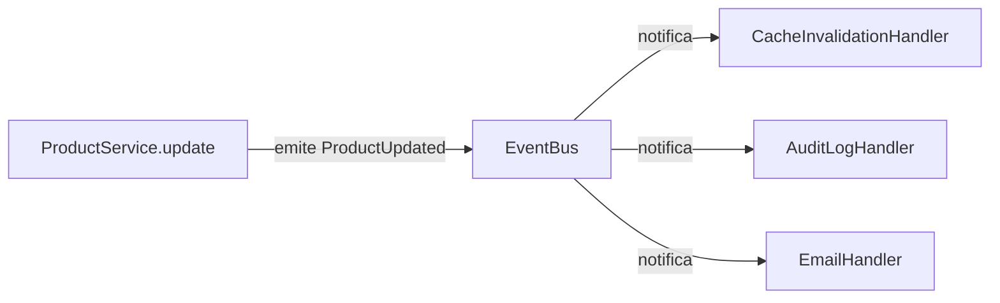
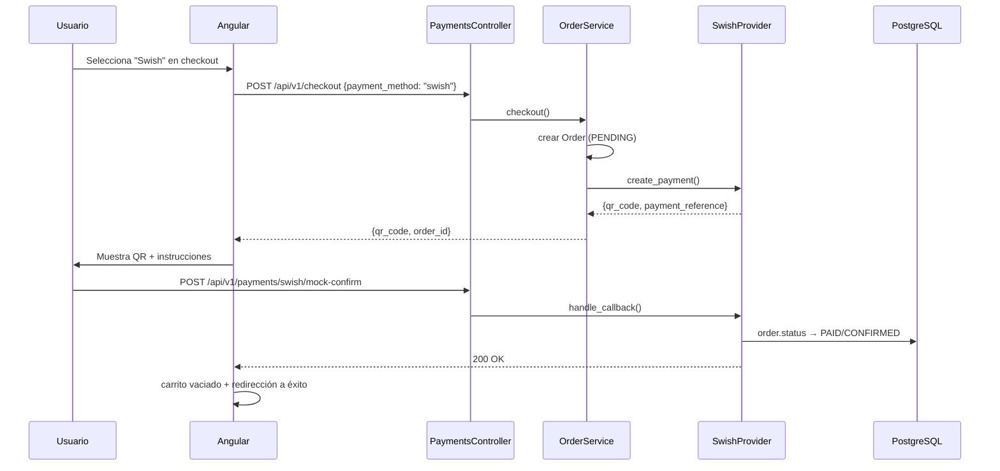
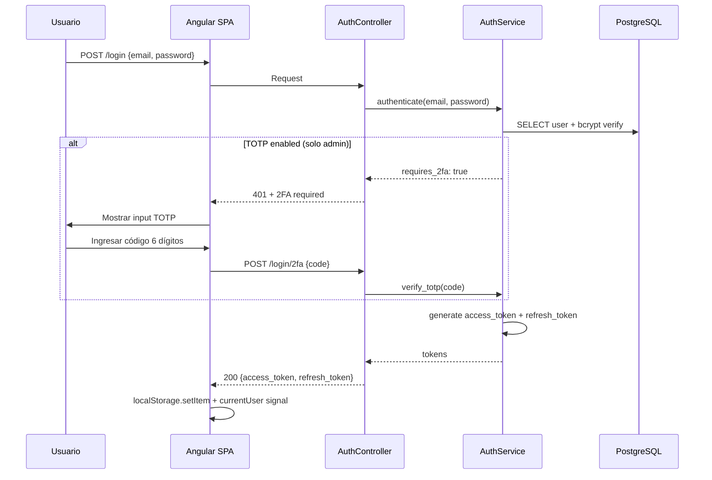
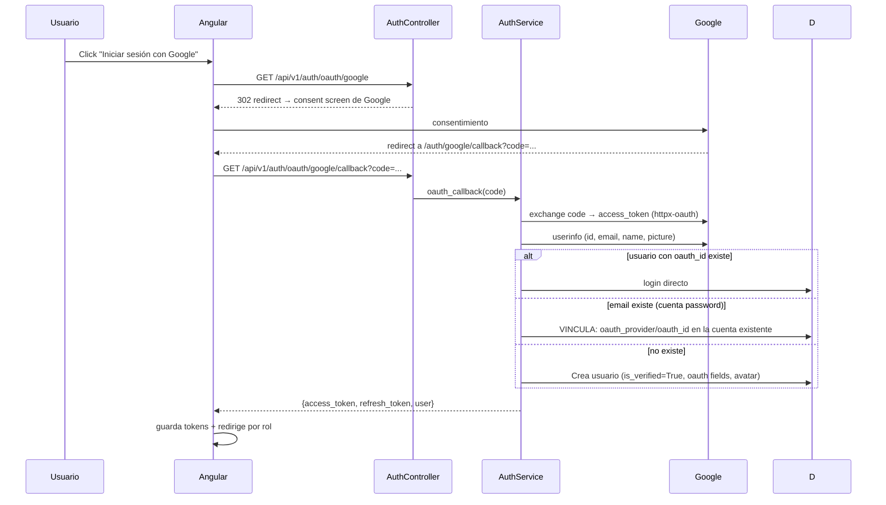
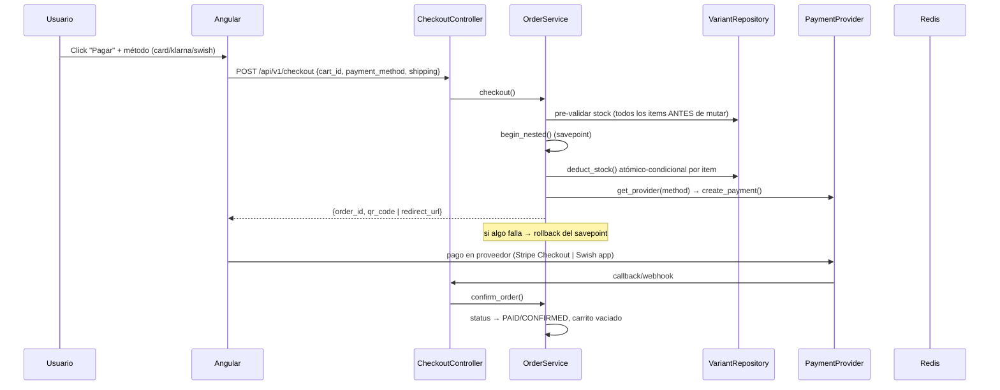
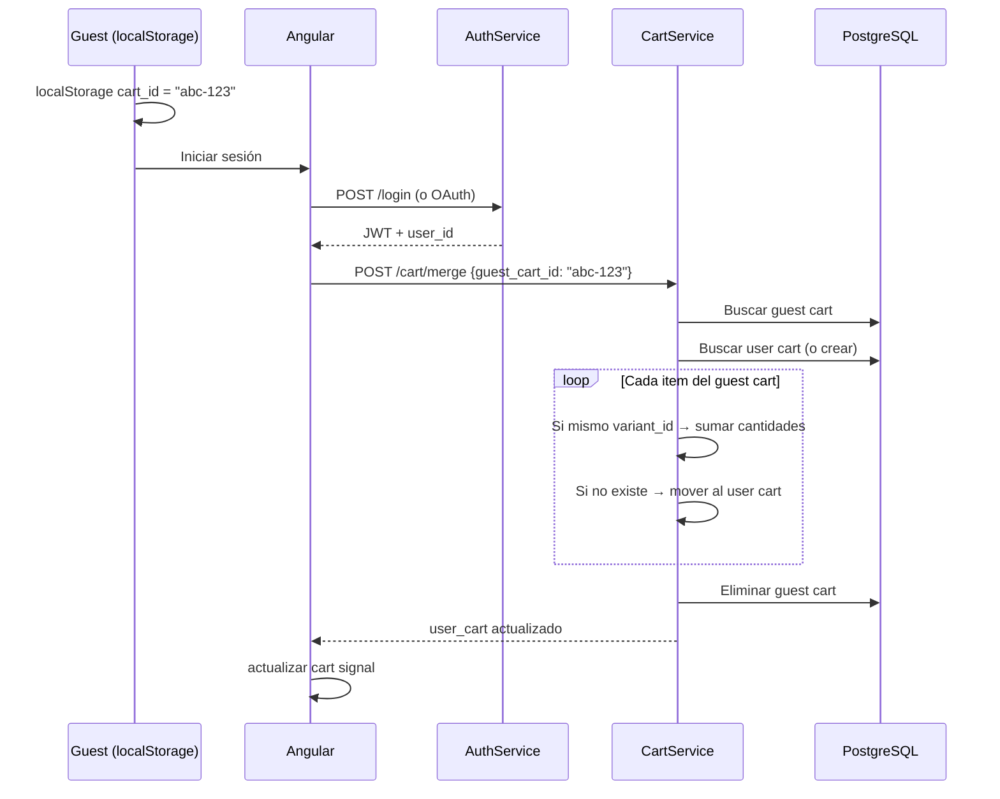

# La Tiendita — Arquitectura y Guía de Estudio

Plataforma e-commerce fullstack para ropa de segunda mano, dirigida al mercado sueco: backend async Python con arquitectura hexagonal (Litestar 2.x), frontend Angular 22 SPA con PrimeNG y Tailwind, PostgreSQL 16, Redis 7 (cache + cola ARQ), pagos multi-provider (Stripe card/Klarna + Swish), email transaccional con Resend, y login social con Google OAuth2. 3.780 nodos en el grafo de código limpio, 319 tests backend, 3 idiomas (es/en/sv).

> **Info**: Esta es la **v2** de la guía (agosto 2026). Respecto a la v1 (julio 2026), incorpora: sistema de pagos multi-provider (Stripe + Klarna + Swish), refactor completo a repository pattern (cero SQL crudo en servicios), email transaccional real con Resend, y Google OAuth2 funcional. Todas las métricas del grafo de código fueron regeneradas con un corpus limpio (solo `backend/` + `frontend/`).

## Contexto

La Tiendita nace como proyecto de portafolio profesional con ambición de producción. El objetivo: demostrar **end-to-end ownership** sobre un sistema completo — desde la arquitectura hexagonal en el backend hasta la UX multi-idioma en el frontend, pasando por decisiones de infraestructura, pagos, testing y compliance regulatorio (GDPR).

> **Why?**: Elegí construir esto como proyecto fullstack en vez de contribuir a open source. Un proyecto propio permite mostrar decisiones de arquitectura con *fundamento real*: por qué Litestar y no FastAPI, cómo el repository pattern encapsula SQLAlchemy, cómo un sistema de pagos multi-provider se abstrae tras una interfaz, o qué pasa cuando un carrito de invitado se mergea con uno de usuario autenticado.

### Métricas del sistema (grafo de código — graphify, 8 agosto 2026)

El grafo de código se genera con **graphify** usando un corpus **whitelisted**: solo `backend/` + `frontend/` (docs, screenshots, vendors minificados quedan fuera — ver sección Análisis del Grafo).

| Métrica | Valor |
|---|---|
| Nodos del grafo | 3.780 |
| Edges (relaciones) | 8.507 |
| Comunidades detectadas | 264 |
| Archivos de código | 373 (199 Python, ~130 TypeScript, resto HTML/CSS/JSON) |
| Tests backend | 319 recolectados, 263+ pasando (23 fallan por BD sin seed) |
| Idiomas UI | 3 (es/en/sv) |
| Migraciones Alembic | 19 |

### Inventario de capas (backend)

| Capa | Archivos | Responsabilidad |
|---|---|---|
| `app/controllers/` | 15 | HTTP, validación Pydantic, guards JWT/admin/rate-limit |
| `app/services/` | 18 | Lógica de negocio — **cero SQL crudo** |
| `app/repositories/` | 16 | Acceso a datos — patrón repositorio |
| `app/models/` | 14 | ORM SQLAlchemy 2.x async |
| `app/schemas/` | — | DTOs Pydantic v2 |
| `app/payments/` | 4 | Multi-provider: interfaz + Stripe + Swish + registry |
| `app/core/` | — | Config, cache, event bus, email, ARQ |
| `app/queries/` | — | SQL crudo para lecturas complejas (CQRS) |
| `migrations/` | 19 | Alembic — se aplican automáticamente al iniciar |

## Arquitectura General

> 📊 *Architecture diagram (arch-global) — see HTML version for interactive view*
>
> <!-- SVG omitted in MD output -->

### Cliente

El frontend es una **Angular 22 SPA** con standalone components, signals para estado reactivo, y RxJS para flujos asíncronos. Soporta 3 idiomas (español, inglés, sueco) vía `ngx-translate` con cambio en caliente (sin recargar).

11 módulos de features con lazy loading:

| Feature | Ruta | Descripción |
|---|---|---|
| Home | `/` | Hero, categorías, nuevos arrivals, sale, newsletter |
| Auth | `/login`, `/register` | JWT + 2FA TOTP, **Google OAuth2**, registro con consentimiento |
| Products | `/productos` | Catálogo con FTS + filtros multi-criterio |
| Product Detail | `/productos/:slug` | Galería, variantes, reviews, wishlist |
| Cart | `/carrito` | Guest merge, stock check, shipping |
| Checkout | `/checkout` | **Selector de 3 métodos de pago**, QR Swish, stock reservation |
| Profile | `/perfil` | Órdenes, wishlist, datos, 2FA, GDPR export |
| Admin | `/admin/*` | Dashboard, CRUD productos/usuarios/categorías/órdenes/promos |
| Legal | `/privacidad`, `/terminos` | GDPR, cookies, términos |
| Sale | `/sale` | Productos en oferta |
| New Arrivals | `/nuevo` | Últimos productos |

### Nginx

Reverse proxy en producción: sirve la SPA compilada desde `/` y redirige `/api/*` al backend Litestar. Puerto 80, sin exposición directa de servicios internos. Terminación TLS centralizada.

### API Gateway

15 controllers Litestar mapean rutas REST a servicios. Cada controller:

- Recibe request con schemas Pydantic v2 validados automáticamente
- Aplica guards (JWT, admin, optional auth, rate-limit) **antes** de entrar al handler
- Delega lógica al service correspondiente
- Retorna Response tipada con serialización automática

```python
from litestar import Controller, get
from app.guards.jwt_guard import jwt_guard
from app.services.product_service import ProductService

class ProductController(Controller):
    path = "/api/v1/products"

    @get("/")
    async def list_products(
        self,
        filters: ProductFilter,           # validacion automatica Pydantic
        product_service: ProductService,  # DI automatica Litestar
    ) -> list[ProductResponse]:
        return await product_service.get_products(filters)
```

> **Tip**: Litestar resuelve automáticamente los parámetros de función como dependencias inyectadas. `async def list_products(self, product_service: ProductService)` — Litestar instancia o reusa `ProductService` según su scope configurado (singleton por defecto). Cero boilerplate de DI.

### Servicios

18 servicios de negocio — cada uno con una responsabilidad única. **Regla de oro del proyecto: los services NO contienen SQL crudo** (verificado con grep en el repo: cero `select()`/`update()` de SQLAlchemy en `app/services/`). Toda la data access vive en repositorios.

Servicios clave (grado real del grafo, agosto 2026):

| Servicio | Responsabilidad | Conexiones en grafo |
|---|---|---|
| `product_service.py` | Catálogo, CRUD, filtros, caché | 77 |
| `promotion_service.py` | Promociones con cap de uso | 79 |
| `order_service.py` | Checkout, stock, estados | 66 |
| `auth_service.py` | Registro, login, refresh, 2FA, **OAuth2** | 52 |
| `admin_user_service.py` | Gestión de usuarios admin | 40 |
| `variant_service.py` | Variantes y stock | 51 |
| `email_service.py` | Transaccionales (Resend/SMTP/log) | — |
| `newsletter_service.py` | Suscripción/desuscripción | — |

> **Why?**: La separación service→repository→model no es decorativa: permite testear los services con mocks de repos (sin BD), centraliza queries complejas, y si mañana migro de PostgreSQL a otra cosa, solo cambian los repositorios. El refactor de agosto 2026 llevó esto al límite: se migraron los últimos 10 queries SQL crudos (6 selects + 4 updates) de los services a métodos de repositorio con semántica atómica-condicional (ver sección Refactor).

### Repositorios

16 repositorios heredando de `BaseRepository` (CRUD genérico: `get_by_id`, `find_one`, `find_all`, `get_paginated`, `add`, `delete`, `count`, `exists`). Cada dominio tiene el suyo:

| Repositorio | Métodos de dominio destacados |
|---|---|
| `UserRepository` | `get_by_email`, `get_with_role`, `get_role`, `update_role`, `get_all_with_order_counts` |
| `ProductRepository` | Filtros complejos, búsqueda FTS |
| `OrderRepository` | `get_with_items`, `count_by_user`, `transition_status`, `unassign_user` |
| `CartRepository` | `get_items`, `upsert_item`, `clear_scope`, `merge_guest_cart` |
| `VariantRepository` | `get_by_sku`, `deduct_stock` (atómico-condicional) |
| `PromotionRepository` | `get_active`, `increment_usage` (cap-safe), `update_fields` |
| `ReviewRepository` | `get_by_product`, `get_aggregate`, `user_has_purchased`, `delete_by_user` |
| `NewsletterSubscriberRepository` | `get_unsubscribed_by_email`, `get_active_by_email` |
| `AuditRepository` | `add`, `delete_by_actor` |
| `RefreshTokenRepository` | `find_by_user`, `delete_user_tokens`, `delete_expired` |

```python
class BaseRepository(Generic[ModelT]):
    def __init__(self, model: type[ModelT]) -> None:
        self.model = model

    async def find_one(self, session: AsyncSession, *where) -> ModelT | None:
        stmt = select(self.model).where(*where)
        return await session.scalar(stmt)

    async def add(self, session: AsyncSession, instance: ModelT) -> ModelT:
        session.add(instance)
        await session.flush()
        return instance
```

### Persistencia

- **PostgreSQL 16**: datos relacionales + full-text search (`tsvector` con triggers automáticos). Alembic maneja 19 migraciones que se aplican al iniciar la app (nunca manualmente en deploy).
- **Redis 7**: cache-aside con TTL configurable por recurso (productos: 5 min, categorías: 30 min) + LRU eviction. También es broker de ARQ para background jobs.

> **Info**: La invalidación de caché se dispara por event bus: cuando un producto se actualiza, `product_service` emite `ProductUpdated`, el handler de caché escucha e invalida las keys relevantes. Sin dependencias circulares.

### Event Bus

Infraestructura de publicador/suscriptor en memoria para cross-cutting concerns:



El bus es **síncrono y en memoria** (no Redis pub/sub). Decisión deliberada: para el volumen actual, añadir un message broker introduce complejidad sin beneficio. Si escala, migrar a Redis Streams o NATS es trivial porque los handlers ya están desacoplados.

El `EmailHandler` abre su **propia sesión** de BD (vía session factory global) para que el envío de emails esté desacoplado del request que lo disparó — los fallos de email se loguean pero nunca bloquean la transacción principal.

### Background Jobs

**ARQ** (Async Redis Queue) ejecuta tareas asíncronas fuera del ciclo request-response:

- Procesamiento de imágenes (redimensionar, convertir a WebP)
- Envío de emails transaccionales (reset password, confirmación orden, welcome)
- Cleanup de tokens expirados

> **Why?**: ARQ sobre Celery: este proyecto es async-first (Litestar + SQLAlchemy async). Celery requiere un thread pool separado para bridge sync/async. ARQ corre nativamente en el event loop de asyncio, solo necesita Redis (sin RabbitMQ), y el código de worker usa los mismos patrones async que la API. Para este tamaño de deploy, simplicidad gana.

### Event Bus y Cache (detalle)

El patrón cache-aside con invalidación por eventos:

```plaintext
Request → ¿cache hit? → SÍ → retornar cache
                     → NO → service → repo → BD
                          → guardar en cache (TTL) → retornar
Mutación → service emite evento → handler invalida keys
```

TTLs actuales: productos list 60s, producto detail 300s, categorías 600s, promociones activas 120s.

## Sistema de Pagos Multi-Provider

La joya de la v2. En vez de acoplar el checkout a un solo proveedor, `app/payments/` define una **interfaz `PaymentProvider`** y dos implementaciones intercambiables vía registry.

### Arquitectura

```plaintext
app/payments/
├── base.py            # PaymentProvider (interfaz abstracta)
├── stripe_provider.py # StripeProvider — card + Klarna (hosted Checkout)
├── swish_provider.py  # SwishProvider — mock por defecto (sin cuenta real)
└── __init__.py        # registry: card/klarna → Stripe, swish → Swish
```

```python
class PaymentProvider(ABC):
    @abstractmethod
    async def create_payment(self, session, order) -> dict: ...
    @abstractmethod
    async def get_status(self, session, reference: str) -> PaymentStatus: ...
    @abstractmethod
    async def handle_callback(self, session, payload) -> dict: ...
    @abstractmethod
    async def refund(self, session, order) -> None: ...
```

```python
def get_provider(method: str) -> PaymentProvider:
    if method in ("card", "klarna"):
        return StripeProvider()
    if method == "swish":
        return SwishProvider()
    raise ValueError(f"unsupported payment method: {method}")
```

El grafo de código confirma el polimorfismo correcto:

```plaintext
StripeProvider --inherits--> PaymentProvider
SwishProvider  --inherits--> PaymentProvider
```

### Stripe (card + Klarna)

- **Card**: Stripe hosted Checkout (PaymentIntent gestionado por Stripe, formulario PCI-compliant).
- **Klarna**: NO requiere provider separado — es `payment_method_types=["card", "klarna"]` en la misma Checkout Session de Stripe. Una línea de configuración.

```python
session = stripe.checkout.Session.create(
    payment_method_types=["card", "klarna"],  # Klarna via Stripe
    mode="payment",
    line_items=[...],
    success_url=f"{FRONTEND_URL}/checkout/success",
    cancel_url=f"{FRONTEND_URL}/checkout/cancel",
)
```

Webhook en `/api/v1/payments/stripe/webhook` — **JWT-exempt** (Stripe firma los payloads, no necesita JWT). Verifica firma con `stripe.Webhook.construct_event()`.

### Swish (mock)

- **Swish es una API sueca propia** (developer.swish.nu) — Stripe NO la soporta. Por eso es un provider aparte.
- Por defecto corre en **`SWISH_MODE=mock`**: el checkout devuelve un QR fake y `POST /api/v1/payments/swish/mock-confirm` confirma la orden localmente. **Sin cuenta de comerciante ni certificados mTLS.**
- Para live: `SWISH_MODE=live` + certificados mTLS + registro de comerciante. **La interfaz no cambia** — solo cambia la implementación interna.

```python
async def create_payment(self, session, order) -> dict:
    if settings.SWISH_MODE == "mock":
        return {
            "qr_code": "data:image/png;base64,...",  # QR falso
            "payment_reference": str(uuid4()),
            "mock_confirm_url": "/api/v1/payments/swish/mock-confirm",
        }
    # live: POST https://mss.swish.nu/api/v2/paymentrequests + mTLS
```

### Modelo de datos de pagos

Migración 0017: el modelo `Order` pasó de `stripe_session_id` (monolítico) a:

| Campo | Tipo | Descripción |
|---|---|---|
| `payment_provider` | str | `stripe` \| `swish` |
| `payment_reference` | str | ID del proveedor (session_id, payment_request) |
| `payment_details` | JSONB | Payload flexible del proveedor |

Esto permite que `OrderService.checkout()` llame a `get_provider(payment_method)` y no sepa NADA de Stripe ni Swish:

```python
provider = get_provider(payment_method)
payment = await provider.create_payment(session, order)
#_ order.payment_provider = payment_method
#_ order.payment_reference = payment["reference"]
```

### Flujo de pago end-to-end (Swish mock)



Verificado E2E en navegador (Playwright): producto → carrito → checkout → Swish QR → mock-confirm → orden PAID/CONFIRMED, stock decrementado, carrito vaciado.

> **Warning**: Card/Klarna requieren `STRIPE_SECRET_KEY` + `STRIPE_WEBHOOK_SECRET` reales (test mode). Sin keys, el checkout llega al StripeProvider y falla con error claro (502). Para desarrollo local sin cuenta Stripe, usa Swish mock — el flujo completo funciona end-to-end sin registrarse en ningún lado.

## Email Transaccional (Resend)

Todos los emails salen por **un único punto de despacho**: `send_email()` en `app/utils/email.py`. El modo se configura con `EMAIL_MODE`:

| Modo | Comportamiento | Uso |
|---|---|---|
| `log` | Imprime el email en consola | Desarrollo |
| `smtp` | Relay SMTP clásico | Alternativa |
| `resend` | **Resend API** (`api.resend.com/emails`) | Producción |

```python
def _send_resend(to: str, subject: str, html_body: str) -> None:
    response = httpx.post(
        "https://api.resend.com/emails",
        headers={"Authorization": f"Bearer {settings.RESEND_API_KEY}"},
        json={"from": settings.EMAIL_FROM, "to": [to],
              "subject": subject, "html": html_body},
        timeout=15,
    )
    response.raise_for_status()
```

Emails transaccionales (todos con templates Jinja2 + i18n es/en/sv):

| Email | Evento disparador | Template |
|---|---|---|
| Welcome | `WelcomeEmailEvent` (registro) | `emails/welcome.html` |
| Confirmación de orden | `OrderConfirmationEvent` (pago finalizado) | `emails/order_confirmation.html` |
| Envío de orden | `OrderShippedEvent` (admin marca shipped) | `emails/order_shipped.html` |
| Reset de password | `PasswordResetEvent` | `emails/password_reset.html` |

> **Tip**: El EmailHandler escucha los eventos con su propia sesión de BD — los fallos de email se loguean pero NUNCA rompen el checkout ni la transacción principal. Los templates se renderizan con Jinja2 desde `app/templates/` y los mensajes i18n se cargan de `app/i18n/{lang}.json` según el idioma preferido del usuario.

## Autenticación y OAuth2

### Flujo estándar: JWT + 2FA



- **Rotación de tokens**: access 15 min, refresh 7 días. El interceptor HTTP renueva automáticamente ante 401 (con coalescing: una sola petición de refresh en vuelo).
- **2FA TOTP solo admin** (PyOTP, RFC 6238 — compatible Google Authenticator).
- Rate limiting por endpoint (20 req/60s por defecto).

### Google OAuth2 (login social) — NUEVO en v2

Implementación completa con `httpx-oauth` (dependencia `httpx-oauth>=0.16`). El modelo `User` ya tenía los campos desde el diseño inicial; ahora se usan de verdad:

```python
oauth_provider: Mapped[str | None]  # "google"
oauth_id:       Mapped[str | None]  # ID del usuario en Google
avatar_url:     Mapped[str | None]  # foto de perfil
is_verified:    Mapped[bool]        # True para emails verificados por Google
```

**Flujo completo:**



**Puntos clave:**

- `GET /oauth/google` redirige a Google (con `state` random para CSRF). Sin `GOOGLE_CLIENT_ID` → 501.
- `GET /oauth/google/callback` intercambia el code — **find-or-create** con 3 ramas: oauth_id match → login; email match → vincular cuenta password existente; ninguno → crear usuario nuevo.
- Usuarios OAuth nacen con `is_verified=True` (Google verifica el email).
- Redirect URI: `GOOGLE_OAUTH_REDIRECT_URI` (default `http://localhost:4200/auth/google/callback`).
- Frontend: `AuthService.initiateGoogleLogin()` (window.location) + `exchangeGoogleCode(code)` + componente `GoogleCallback` que captura el `?code=`. Botón de Google activado en el login con i18n en 3 idiomas.

> **Warning**: La vinculación por email es un vector de account-takeover si se hace mal: si un atacante registra una cuenta con tu email ANTES de que hagas OAuth, la vincularía. Mitigación parcial: solo vincula si la cuenta NO tiene password_hash propio O si el email está verificado. Evaluar flujo de "confirmar propiedad del email" antes de habilitar en producción real.

### Decisiones de seguridad

- bcrypt para passwords (25 años probado; argon2 es teóricamente superior pero requiere libs nativas que complican el deploy).
- python-jose para JWT (forward-compatible con OIDC — elegido ANTES del OAuth justamente por eso).
- Webhooks de Stripe con verificación de firma obligatoria.
- JWT-exempt solo en rutas que lo justifican: `/api/v1/payments/*` (firma del proveedor) y `/api/v1/stripe/webhook`.
- Audit log con actor/acción/entidad para cada mutación administrativa.

## Flujos Clave End-to-End

### Checkout con Stock Reservation (multi-provider)



**Dos detalles de corrección críticos:**

1. **Pre-validación + savepoint**: primero se valida TODO el stock (sin mutar), luego se envuelven TODAS las mutaciones en `begin_nested()` — si cualquier deducción falla, todo el savepoint se revierte atómicamente. No hay estado intermedio.
2. **Updates atómicos-condicionales (TOCTOU-safe)**: la deducción de stock NO es "leer, restar, escribir" (race condition). Es un solo UPDATE con condición:

```python
async def deduct_stock(self, session, variant_id, qty) -> bool:
    result = await session.execute(
        update(ProductVariant)
        .where(ProductVariant.id == variant_id,
               ProductVariant.stock >= qty,
               ProductVariant.deleted_at.is_(None))
        .values(stock=ProductVariant.stock - qty,
                reserved_stock=ProductVariant.reserved_stock - qty)
        .returning(ProductVariant.id)
    )
    return result.scalar_one_or_none() is not None
```

Si dos checkouts concurrentes piden el mismo variant, solo uno gana — el otro recibe `False` y revierte. Sin locks manuales, sin sobreventa.

### Promotions con cap de uso (TOCTOU-safe)

El incremento de `current_uses` de una promoción usa el MISMO patrón:

```python
async def increment_usage(self, session, code) -> bool:
    result = await session.execute(
        update(Promotion)
        .where(Promotion.code == code)
        .where(Promotion.max_uses.is_(None)
               | (Promotion.current_uses < Promotion.max_uses))
        .values(current_uses=Promotion.current_uses + 1)
        .returning(Promotion.id)
    )
    return result.scalar_one_or_none() is not None
```

Concurrent checkouts no pueden sobrepasar el cap de usos de una promo — el UPDATE falla (0 rows) cuando el cap se agota.

### Admin: transición de estados de orden (anti-TOCTOU)

```python
async def transition_status(self, session, order_id, current_status, target_status) -> bool:
    result = await session.execute(
        update(Order)
        .where(Order.id == order_id)
        .where(Order.status == current_status)  # guard anti-race
        .values(status=target_status)
    )
    return result.rowcount > 0
```

El `WHERE status = current` evita que dos admins transicionen la misma orden sobre estado stale. Si el rowcount es 0 → `InvalidTransitionError`.

### Guest Cart Merge



## Arquitectura del Frontend

### Estructura de Features

```plaintext
frontend/src/app/
├── core/               # Servicios globales, guards, interceptors, modelos
├── features/           # Módulos lazy-loading (11 features)
│   ├── home/           # Landing page
│   ├── auth/           # Login + registro + 2FA + google-callback/
│   ├── products/       # Catálogo con filtros
│   ├── product-detail/ # Ficha de producto
│   ├── cart/           # Carrito de compras
│   ├── checkout/       # Flujo de pago (selector de 3 métodos)
│   ├── profile/        # Perfil, órdenes, wishlist
│   ├── admin/          # Panel de administración (8 sub-módulos)
│   ├── legal/          # Privacidad y términos
│   ├── sale/           # Productos en oferta
│   └── new-arrivals/   # Últimos productos
├── shared/             # Componentes reutilizables
│   ├── components/     # product-card, search-bar, pagination, star-rating,
│   │                   # cookie-consent, newsletter-popup, recently-viewed,
│   │                   # scroll-top, share-button, sizing-guide
│   ├── models/         # Interfaces compartidas
│   ├── pipes/          # Pipes personalizados
│   └── directives/     # Directivas reutilizables
└── layout/             # Header, footer, admin-layout, mobile-nav
```

### State Management

La app usa dos estrategias según el caso:

| Estrategia | Uso | Ejemplo |
|---|---|---|
| **Angular Signals** | Estado local + compartido simple | `currentUser()`, `cartCount()`, `theme()` |
| **RxJS BehaviorSubject** | Flujos asíncronos multi-consumidor | `CategoryService.categories$`, `CartService.cart$` |

```typescript
// AuthService — signal computada
readonly currentUser = computed(() => this._user());
readonly isAdmin = computed(() => this.currentUser()?.role === 'admin');

// CartService — signal sincronizada con API
readonly cartItems = signal<CartItem[]>([]);
readonly cartCount = computed(() =>
  this.cartItems().reduce((sum, item) => sum + item.quantity, 0)
);
```

### AuthService del frontend (login + OAuth)

```typescript
// Google OAuth — redirige al backend → consent screen
initiateGoogleLogin(): void {
  window.location.href = '/api/v1/auth/oauth/google';
}

// Callback: intercambia el code de Google por nuestros JWT
exchangeGoogleCode(code: string): Observable<TokenResponse> {
  return this.http.get<TokenResponse>(
    `/api/v1/auth/oauth/google/callback`, { params: { code } },
  ).pipe(tap((res) => {
    this.tokenStorage.setTokens(res.access_token, res.refresh_token);
    this.authState.setUser(res.user);
  }));
}
```

El componente `GoogleCallback` (ruta `auth/google/callback`) lee el `?code=` del query param, llama a `exchangeGoogleCode`, inicia `SessionExpirationService` y redirige por rol (admin → `/admin`, customer → `/`). Maneja errores con mensajes i18n.

### Guards e Interceptors

```typescript
// Interceptor HTTP: renueva access token automáticamente (con coalescing)
intercept(req, next) {
  if (this.authService.isTokenExpired()) {
    return this.authService.refreshToken().pipe(
      switchMap(() => next.handle(this.addAuthHeader(req)))
    );
  }
  return next.handle(this.addAuthHeader(req));
}

// Guard de admin: verifica rol antes de lazy-load
canActivate(): boolean {
  if (!this.authService.isAdmin()) {
    this.router.navigate(['/']);
    return false;
  }
  return true;
}
```

El refresh tiene **coalescing**: si ya hay un refresh en vuelo, los nuevos 401 esperan el MISMO observable compartido — una sola llamada HTTP, todos los subscribers reciben el mismo token nuevo.

### Multi-idioma (i18n)

Tres archivos JSON con claves estructuradas (es/en/sv). `ngx-translate` carga el archivo correspondiente según `navigator.language` o preferencia guardada. El language switcher en el header persiste en `localStorage`. **Regla: todo string visible al usuario debe venir de traducciones.**

## Refactor Repository Pattern (agosto 2026)

### El problema detectado

El análisis del grafo (graphify + LLM) detectó queries SQL crudas en la capa de servicios — deuda residual del refactor anterior:

```plaintext
app/services/newsletter_service.py: 3× select() crudo
app/services/admin_user_service.py: 3× select() + 1× update() crudo
app/services/promotion_service.py: 1× update() crudo
app/services/order_service.py:      2× update() crudo
app/services/admin_order_service.py: 1× update() crudo
```

### La solución

Se migraron TODOS a métodos de repositorio con semántica de dominio (no `execute(select(...))` genérico):

| Query cruda | → Método de repositorio | Semántica |
|---|---|---|
| `select(NewsletterSubscriber).where(unsubscribed_at)` | `NewsletterSubscriberRepository.get_unsubscribed_by_email` | Re-activación |
| `select(NewsletterSubscriber).where(unsubscribed_at IS NULL)` | `NewsletterSubscriberRepository.get_active_by_email` | Unsubscribe/check |
| `select(User.role)` | `UserRepository.get_role` | Audit trail |
| `update(User)...returning` | `UserRepository.update_role` | UPDATE…RETURNING |
| `select(AuditLog)` | `AuditRepository.delete_by_actor` | Teardown |
| `select(CartItem/Review/Wishlist/RefreshToken/PasswordReset)` | `clear_scope` + `delete_by_user` + `delete_user_tokens` | Teardown cascade |
| `update(Order).values(user_id=None)` | `OrderRepository.unassign_user` | Preserva historial |
| `update(Promotion)` parcial | `PromotionRepository.update_fields` | Update de campos |
| `update(Promotion).current_uses+1` | `PromotionRepository.increment_usage` | Cap-safe |
| `update(ProductVariant).stock-qty` | `VariantRepository.deduct_stock` | Atómico-condicional |
| `update(Order).where(status=current)` | `OrderRepository.transition_status` | Anti-TOCTOU |

### El resultado medido

El grafo lo confirma cuantitativamente (antes → después):

| Métrica | Antes | Después | Delta |
|---|---|---|---|
| Edges service→repository | 206 | 316 | **+110 (+53%)** |
| Edges service→model | 383 | 398 | +15 (estable) |
| Ratio repo:model del acoplamiento | 0.54 | **0.79** | +46% |
| `OrderRepository` degree | 72 | 81 | +9 |
| `CartRepository` degree | 71 | 85 | +14 |
| SQL crudo en services | 10 | **0** | ✅ |

El acoplamiento de los servicios se MOVIÓ hacia los repositorios — exactamente lo que la arquitectura hexagonal prescribe.

> **Common mistake**: GOTCHA del refactor: `transition_status` NO debe hacer `flush()` internamente. El patrón correcto es repo → bool, service → raise si False → flush después. Si el repo flushea antes del raise, un test que verifica "no flush tras rowcount=0" falla y, peor, semánticamente el flush con estado inválido puede ocultar errores.

## Análisis del Grafo de Código

### Corpus limpio (lección aprendida)

El grafo se regenera con **whitelist estricta** en `.graphifyignore`: solo `backend/` + `frontend/`. La primera versión contaminada incluía `docs/` (study-guide con vendors `.min.js` de mermaid/gsap/katex) y 106 screenshots PNG — resultó en **12.483 nodos falsos** dominados por símbolos minificados (`_()`, `push()`, `a5e()`). El corpus limpio tiene 3.780 nodos reales.

```plaintext
/*        ← ignora todo en la raíz
!backend  ← re-incluye backend (UNANCHORED — ver gotcha)
!frontend ← re-incluye frontend
```

> **Common mistake**: GOTCHA de graphify: las negaciones del `.graphifyignore` deben ser **unanchored** (`!backend`, NO `!/backend/`). El parser hace `pattern[1:]` y un `/` posterior re-ancla el patrón, que solo matchea el dir exacto y nunca su contenido. Con `fnmatch` cruzando `/`, `/*` se traga todo a cualquier profundidad.

### God nodes (los pesos pesados reales)

| Nodo | Degree | Rol |
|---|---|---|
| `Product` | 151 | Modelo central del catálogo |
| `Order` | 124 | Núcleo de ventas |
| `User` | 110 | Identidad |
| `ProductTranslation` | 88 | i18n del catálogo |
| `CartRepository` | 86 | Acceso a datos del carrito |
| `OrderRepository` | 81 | Datos de pedidos |
| `PromotionService` | 79 | Lógica de negocio |
| `ProductService` | 77 | Catálogo |

### Comunidades más grandes

| Comunidad | Nodos |
|---|---|
| Category and Product Controllers | 103 |
| Product Service | 92 |
| Cart Repository | 88 |
| Email Event Handler | 77 |
| Product Variant Repositories | 61 |
| Order Payment Models | 59 |
| Stripe/Swish Payment Provider | 28/12 |

### Lectura arquitectónica del grafo

- **0 dependencias cross-layer frontend↔backend** — comunican solo por HTTP. Desacople perfecto.
- La capa de pagos está aislada: 4 comunidades dedicadas (Stripe Provider, Swish Provider, Payment Webhooks, Order Payment Models).
- Los "import cycles" reportados son todos 1-file (falsos positivos del AST por imports tardíos dentro de funciones — patrón conocido, no deuda real).
- `order_service.py` toca 13 comunidades distintas — es el hub de integración del checkout. Vigilar si crece más.

## Decisiones Técnicas y Tradeoffs

Cada decisión de arquitectura, framework y librería tiene una razón concreta. Ordenadas por categoría, con el qué, el por qué, y qué se rechazó.

### Arquitectura

#### ¿Por qué arquitectura hexagonal (ports & adapters)?

```plaintext
┌─────────────────────────────────────────────────┐
│                  Controllers                    │  ← Adapters (in)
│            (HTTP, validación, guards)           │
└──────────────────────┬──────────────────────────┘
                       ▼
┌─────────────────────────────────────────────────┐
│                   Services                      │  ← Application core
│            (reglas de negocio, casos de uso)    │
└──────┬──────────────────────────────────┬───────┘
       ▼                                  ▼
┌──────────────┐               ┌─────────────────┐
│ Repositories │               │   Event Bus     │  ← Ports
│  (data acc)  │               │  (pub/sub)      │
└──────┬───────┘               └─────────────────┘
       ▼
┌──────────────┐
│   Models     │  ← Adapters (out)
│  (SQLAlchemy)│
└──────────────┘
```

> **Why?**: Separar el dominio (services) de la infraestructura (controllers, repositories, BD) permite tres cosas críticas: (1) los services se testean sin BD ni HTTP — solo mocks de repositorios, (2) cambiar PostgreSQL por otra cosa toca solo repositories y models, y (3) las reglas de negocio viven en UN lugar. El refactor de agosto 2026 llevó el patrón al límite: cero SQL en services, updates atómicos-condicionales en repos.

#### ¿Por qué repository pattern y no ORM directo en services?

```python
class ProductService:
    async def get_products(self, session: AsyncSession):
        return await session.execute(select(Product))
```

```python
class ProductService:
    async def get_products(self, repo: ProductRepository):
        return await repo.find_with_filters(...)
```

> **Why?**: El repository pattern crea una frontera clara: los services no saben SQL ni SQLAlchemy — solo hablan con interfaces de repositorio. Permite mockear repos en tests unitarios sin BD, centralizar queries complejas (CQRS), y migrar de BD sin tocar servicios. La versión moderna incluye métodos con semántica atómica-condicional (`deduct_stock`, `increment_usage`, `transition_status`) que hacen imposible la sobreventa o el doble-uso de promos por race conditions.

#### ¿Por qué event bus en memoria y no message broker?

> **Why?**: El event bus resuelve cross-cutting concerns (audit log, cache invalidation, emails) sin acoplar servicios. Un broker añadiría latencia de red, reconexión, ordering guarantees — complejidad sin beneficio a este volumen. El bus síncrono ejecuta handlers en el mismo request (correcto para audit que DEBE pasar antes del commit). Si escala, migrar a Redis Streams es trivial.

#### ¿Por qué cache-aside y no write-through o write-back?

> **Why?**: Cache-aside es el más simple y resiliente: si Redis cae, la app sigue funcionando (lee de BD, solo más lento). Write-through acopla escrituras a la disponibilidad de Redis; write-back puede perder datos si Redis muere antes del flush. Para un e-commerce donde la consistencia de inventario es crítica, cache-aside + invalidación por event bus da el balance correcto.

#### ¿Por qué JWT y no server sessions?

| Factor | JWT | Server Sessions |
|---|---|---|
| Escalado horizontal | Stateless — cualquier instancia valida | Requiere sesión compartida (Redis/DB) |
| Mobile/OAuth | Nativo — token en header | Cookies con CORS complejas en mobile |
| Invalidación | Refresh rotation + blacklist | Borrar sesión en store |
| Tamaño | ~500 bytes self-contained | Session ID + lookup en cada request |

> **Why?**: JWT permite escalar horizontalmente sin estado compartido. Las sessions requieren un store compartido consultado en CADA request. Para un deploy que puede crecer a múltiples instancias, JWT elimina un punto de falla. El tradeoff (invalidación) se maneja con refresh rotation de 7 días.

### Stack de Backend

#### ¿Por qué Litestar y no FastAPI?

| Factor | Litestar | FastAPI (rechazado) |
|---|---|---|
| Dependency Injection | Nativo con scopes (singleton, request, connection) | Requiere `python-dependency-injector` externo |
| Guards de auth | Declarativos tipados como decoradores | Dependencias como callables manuales |
| Event system | Señales incorporadas | No nativo |
| OpenAPI | Generación desde tipos Python | Automática pero menos flexible |
| Maturidad | Más nuevo, menos comunidad | Estándar de facto |

> **Tip**: La pregunta real en entrevista es **"¿por qué elegiste una alternativa menos popular?"**. Respuesta: Litestar resuelve los problemas CONCRETOS — DI scoped, guards declarativos, señales para el event bus. FastAPI es excelente, pero Litestar eliminó 3 dependencias externas y ~200 líneas de boilerplate. Tradeoff aceptado: menos talent pool.

#### ¿Por qué SQLAlchemy 2.x async y no SQLModel o Tortoise?

> **Why?**: SQLAlchemy 2.x es el ORM más maduro (15+ años), async nativo desde 2.0, ecosistema enorme (Alembic, FTS), y permite mezclar ORM y SQL crudo según convenga (esencial para CQRS — ver `app/queries/`). SQLModel acopla modelo de BD a schema de API — viola la separación de capas. Tortoise tiene ecosistema más pequeño. SQLAlchemy gana por madurez, flexibilidad y ecosystem.

#### ¿Por qué Pydantic v2 para DTOs?

> **Why?**: Pydantic v2 (Rust) valida y serializa 5-10x más rápido que v1. Litestar lo usa para validación automática de requests y generación de OpenAPI. Alternativas: `dataclasses` no validan en runtime, `marshmallow` es más lento y menos integrado con type checkers. Pydantic v2 es el estándar de facto.

#### ¿Por qué PostgreSQL 16 y no MySQL o SQLite?

| Factor | PostgreSQL 16 | MySQL 8 | SQLite |
|---|---|---|---|
| Full-Text Search | `tsvector` nativo con ranking | Limitado | FTS5 básico |
| JSON columns | JSONB indexable | JSON sin indexación eficiente | JSON1 extensión |
| Tipos avanzados | UUID, ARRAY, Range | Limitado | Limitado |
| Concurrency | MVCC | MVCC con gotchas | Single-writer lock |

#### ¿Por qué Redis 7 (cache + queue) y no Memcached + RabbitMQ?

> **Why?**: Redis hace dos trabajos: cache-aside con TTL y broker de ARQ. Memcached + RabbitMQ = un servicio más que operar. Redis 7 tiene data structures ricas, persistencia opcional, LRU eviction nativo. Un servicio que hace dos cosas > dos servicios especializados a este tamaño.

#### ¿Por qué el sistema de pagos es multi-provider y no Stripe-only?

> **Why?**: El mercado sueco paga con **Swish** (el 70%+ de pagos P2P en Suecia es Swish). Stripe NO soporta Swish — es una API sueca propia con certificados mTLS. En vez de hardcodear dos integraciones en el checkout, se abstrajo detrás de `PaymentProvider`: el checkout llama `get_provider(method)` y no sabe nada de Stripe ni Swish. Klarna entra gratis (es un flag en Stripe Checkout). Cuando el usuario tenga cuenta Swish real, solo se cambia `SWISH_MODE=live` — la interfaz no cambia. Esto es el Open/Closed Principle aplicado: abierto a extensión, cerrado a modificación.

#### ¿Por qué Resend para email transaccional y no SMTP directo o SendGrid?

| Factor | Resend | SMTP propio | SendGrid |
|---|---|---|---|
| Setup | API key + 1 endpoint | Configurar relay, SPF/DKIM | API key |
| Deliverability | Alta (infra moderna) | Depende de tu IP/reputación | Alta |
| Free tier | 100 emails/día | — | 100/día |
| Modernidad | API JSON + webhooks | Protocolo 1982 | Legacy-first |

> **Why?**: Resend es la opción moderna de la industria: API REST JSON, SDKs, free tier generoso, deliverability gestionada (no pelear con reputación de IP). El código quedó aislado detrás de `send_email()` con `EMAIL_MODE` — probar en dev con `log`, producción con `resend`, sin tocar los services. Se rechazó SMTP directo porque la deliverability de Gmail/Hotmail depende de reputación de IP que no controlas en un VPS barato.

#### ¿Por qué httpx-oauth para Google OAuth y no authlib?

> **Why?**: `httpx-oauth` ya estaba en las dependencias (es async-native como todo el stack: httpx, no requests), cubre el flujo `get_authorization_url` + `get_access_token` + `get_id_email` en 3 llamadas, y pesa menos que authlib (que trae clientes para 20+ proveedores que no usamos). YAGNI: si mañana se agrega GitHub o Facebook, httpx-oauth tiene clientes listos con la MISMA interfaz.

### Stack de Frontend

#### ¿Por qué Angular 22 y no React o Vue?

| Factor | Angular 22 | React 19 | Vue 3 |
|---|---|---|---|
| Opinión de estructura | Opinable — modular por diseño | Libre — requiere decisiones | Semi-opinable |
| TypeScript | Nativo, first-class | Opcional (JSX mezcla) | Soporte pero opcional |
| Forms complejos | Reactive Forms + validación | Librerías externas | VueUse menos maduro |
| Enterprise-scale | DI, módulos lazy, guards nativos | Arquitectura manual | Similar a React |
| Signals | Nativas desde v17 | useEffect/useMemo | ref/reactive |

#### ¿Por qué PrimeNG y no Angular Material?

| Necesidad del proyecto | PrimeNG | Angular Material |
|---|---|---|
| Tablas con sort/filter/pagination | `p-table` nativo | `MatTableDataSource` + config manual |
| Multi-select con chips | `p-multiSelect` listo | No existe |
| File upload con preview | `p-fileUpload` | No existe |
| Iconos (2,500+) | PrimeIcons | Material Icons limitado |
| Dark mode | Toggle nativo | Tema custom |

> **Common mistake**: No confundir "más popular" con "mejor para tu caso". Material es sobresaliente para dashboards; una tienda necesita multi-select para filtros, file upload y 2,500 iconos de moda/pagos. Decisión técnica, no estética.

#### ¿Por qué Signals + RxJS y no NgRx?

> **Why?**: NgRx añade 4 conceptos (actions, reducers, selectors, effects) y boilerplate. El estado de La Tiendita es mayoritariamente local por feature: carrito en CartService, auth en AuthService. Signals + BehaviorSubject cubren el 100% sin overhead. YAGNI — migrar a NgRx es incremental si el estado se complica.

#### ¿Por qué ngx-translate y no i18n nativo?

> **Why?**: El i18n nativo de Angular compila UN build POR idioma — 3 builds para es/en/sv. ngx-translate carga JSON en runtime, permitiendo cambiar idioma sin recargar. Para un e-commerce con language switcher (crítico en mercado sueco), el cambio en caliente es no-negociable.

#### ¿Por qué Tailwind v3 + PrimeUI y no SCSS puro?

> **Why?**: Tailwind da utility classes sin escribir CSS custom; PrimeUI tematiza PrimeNG. Juntos: Tailwind estructura, PrimeUI da el design system. SCSS custom = semanas de trabajo. Para un portfolio donde el foco es arquitectura y UX, esta combinación es la más productiva.

### Infraestructura

#### ¿Por qué Docker multi-stage?

> **Why?**: Multi-stage separa el contexto de build del runtime. Imagen de producción ~150 MB vs ~800 MB. Menos superficie de ataque, deploys más rápidos. Python: `python:3.14-slim` runtime; Angular: build con node, sirve con `nginx:alpine` (~30 MB).

#### ¿Por qué Nginx como reverse proxy?

> **Why?**: Nginx da: (1) TLS centralizado, (2) estáticos de la SPA sin pasar por Python, (3) rate limiting a nivel edge, (4) rotar instancias sin que el cliente note. Exponer uvicorn directo es anti-patrón.

#### ¿Por qué GitHub Actions?

> **Why?**: Nativo del repo (cero infra), marketplace de actions, minutos gratis para open source. Jenkins = mantener servidor. GitLab CI = migrar de GitHub. Menor fricción.

### Anti-patrones evitados

#### ¿Por qué NO microservicios?

> **Danger**: Para un proyecto de un desarrollador, microservicios serían over-engineering: 8+ servicios que desplegar, latencia de red, consistencia distribuida (sagas, outbox), observabilidad compleja. La arquitectura hexagonal modular permite extraer un microservicio cuando un módulo lo justifique por carga. Monolith first, extraer después.

#### ¿Por qué NO GraphQL?

> **Why?**: GraphQL brilla con múltiples clientes con necesidades distintas. Con un solo cliente (Angular SPA) y endpoints bien definidos, REST es más simple: caché HTTP nativo, status codes, tooling maduro. Si mañana hay mobile nativo, GraphQL sería el camino.

#### ¿Por qué NO event sourcing?

> **Why?**: Event sourcing da auditoría perfecta pero añade event store, proyecciones, snapshots, eventual consistency. El audit log tradicional (tabla actor/acción/entidad) cubre compliance a fracción del costo. Event sourcing se justifica en sistemas financieros hiper-regulados, no en un e-commerce de portfolio.

## Infraestructura

### Docker Compose (Dev)

```yaml
services:
  postgres:
    image: postgres:16-alpine
    ports: ["5432:5432"]
    volumes: [pgdata:/var/lib/postgresql/data]

  redis:
    image: redis:7-alpine
    ports: ["6379:6379"]

  api:
    build: ./backend
    ports: ["8000:8000"]
    depends_on: [postgres, redis]
    environment: {DATABASE_URL, REDIS_URL, STRIPE_KEY, JWT_SECRET}

  frontend:
    build: ./frontend
    ports: ["4200:4200"]
    depends_on: [api]

  worker:
    build: ./backend
    command: arq app.tasks.WorkerSettings
    depends_on: [redis, postgres]
```

### Producción

`docker-compose.prod.yml` agrega nginx sirviendo la SPA compilada, uvicorn sin --reload, worker ARQ separado, volúmenes persistentes.

```yaml
services:
  nginx:
    image: nginx:alpine
    ports: ["80:80"]
    volumes:
      - ./nginx.prod.conf:/etc/nginx/conf.d/default.conf
      - ./frontend/dist:/usr/share/nginx/html
```

### Variables de entorno clave (`.env`)

| Variable | Rol | Estado default |
|---|---|---|
| `DATABASE_URL` | Conexión PostgreSQL async | requerida |
| `REDIS_URL` | Cache + cola ARQ | `redis://localhost:6379/0` |
| `SECRET_KEY` | Firma JWT | requerida |
| `EMAIL_MODE` | `log` \| `smtp` \| `resend` | `log` |
| `RESEND_API_KEY` | Email Resend | vacía (dev = log) |
| `GOOGLE_CLIENT_ID/SECRET` | OAuth2 | vacías (dev = 501) |
| `GOOGLE_OAUTH_REDIRECT_URI` | Callback OAuth | `http://localhost:4200/auth/google/callback` |
| `STRIPE_SECRET_KEY/WEBHOOK_SECRET` | Stripe | vacías (usa Swish mock) |
| `SWISH_MODE` | `mock` \| `live` | `mock` |
| `FRONTEND_URL` | URL del frontend | `http://localhost:4200` |

## Testing

### Estrategia por capa

| Capa | Framework | Estado |
|---|---|---|
| Backend unit | pytest + pytest-asyncio (modo STRICT) | 319 recolectados, 263+ pass |
| Backend integration | pytest contra PostgreSQL real | `test_*_integration.py` — 8+ pass con BD |
| Frontend unit | vitest (`@angular/build:unit-test`) | 29 specs |
| E2E | Playwright (desktop/tablet/mobile) | flujo completo verificado |

> **Warning**: 23 tests fallan cuando la BD no tiene seed (catalog/FTS/seed/promotions). No es deuda de código — es infraestructura: `python scripts/seed_real.py` (300 productos reales con traducciones) arregla el entorno.

### Patrones de testing usados

```python
async def test_oauth_callback_creates_user(session, monkeypatch):
    # Arrange: mockear el intercambio con Google
    async def fake_get_access_token(self, code, redirect_uri, client):
        return {"access_token": "fake-google-token"}
    monkeypatch.setattr("httpx_oauth.clients.google.GoogleOAuth2.get_access_token",
                        fake_get_access_token)

    # Act: ejecutar el callback OAuth
    result = await svc.oauth_callback(session, "code123")

    # Assert: usuario creado con datos de Google
    assert result.user.email == "oauth-new@example.com"
    assert result.user.is_verified is True
```

> **Tip**: Los tests de integración usan la BD real (PostgreSQL en docker) — `docker compose up -d db redis` y correr `python -m pytest tests/test_admin_integration.py tests/test_orders_integration.py`. Los tests de unit NO requieren BD (repos mockeados).

### Lecciones aprendidas del testing

- Los 3 JSON i18n tenían una coma faltante → toda la app mostraba keys crudas. Hoy validado en pre-commit.
- Las fixtures E2E llamaban API sin prefijo `/api/v1` → 404 silenciosos. Se corrigió `API_URL`.
- El auth guard mantiene `currentUser` en memoria tras borrar localStorage → tests de redirect usan `browser.newContext()`.
- **Flush vs raise**: el patrón repo → bool / service → raise / flush DESPUÉS del raise. Flushear antes de un raise esperado rompe tests y oculta errores.
- pytest-asyncio en modo STRICT requiere `@pytest.mark.asyncio` por test.
- MagicMock como session rompe en `flush()` — usar AsyncMock.

## Quiz de Autoevaluación

### Sección 1: Arquitectura

**Quiz**: ¿Cuál es la principal razón para elegir Litestar sobre FastAPI en este proyecto?

- [ ] Litestar es más rápido que FastAPI en benchmarks
- [✓] Su sistema de DI nativo elimina boilerplate y sus guards son más declarativos
- [ ] FastAPI no soporta async/await
- [ ] Litestar es más popular en la comunidad Python

*Explanation*: Litestar se eligió por su sistema de Dependency Injection nativo con scopes (singleton/request/connection) y guards declarativos tipados. FastAPI requiere dependencias externas para DI y el patrón de guards es menos expresivo.

### Sección 2: Pagos multi-provider

**Quiz**: ¿Cómo se integra Klarna al sistema de pagos?

- [ ] Como un PaymentProvider separado con su propia API
- [✓] Como payment_method_types=['card', 'klarna'] en la misma Checkout Session de Stripe
- [ ] Stripe no soporta Klarna, se necesita un provider dedicado
- [ ] Klarna se procesa offline y se confirma manualmente

*Explanation*: Klarna NO requiere provider separado — es un flag en la Checkout Session de Stripe (payment_method_types=['card', 'klarna']). El registry solo tiene 2 providers: Stripe (card+klarna) y Swish (API sueca propia que Stripe NO soporta).

**Quiz**: El sistema de pagos multi-provider usa el principio Open/Closed: abierto a extensión (nuevos providers) y cerrado a modificación (el checkout no cambia).

- [✓] Verdadero
- [ ] Falso

*Explanation*: Correcto. El checkout llama get_provider(method) y no conoce la implementación. Agregar un provider nuevo (p.ej. PayPal) es crear una clase que implementa PaymentProvider y registrarla — el OrderService no se toca.

### Sección 3: Refactor repository pattern

**Quiz**: ¿Qué patrones atómico-condicionales se implementaron en el refactor de repositorios? (Selecciona todas las correctas)

- [✓] deduct_stock: UPDATE con WHERE stock >= qty para evitar sobreventa
- [✓] increment_usage: UPDATE con WHERE current_uses < max_uses para respetar el cap de promos
- [✓] transition_status: UPDATE con WHERE status = current para evitar races entre admins
- [ ] get_by_email: SELECT con LOCK FOR UPDATE para serializar lecturas

*Explanation*: Los tres updates atómicos-condicionales son TOCTOU-safe: la condición va en el WHERE del UPDATE, no hay leer-comparar-escribir. get_by_email es una lectura normal — no necesita lock porque las mutaciones críticas usan los patrones condicionales.

**Quiz**: ¿Por qué transition_status NO debe hacer flush() internamente?

- [ ] Porque flush() es lento y el update ya se ejecutó
- [✓] Para que el service pueda hacer raise ANTES del flush cuando rowcount=0, preservando la semántica del error
- [ ] Porque SQLAlchemy no permite flush en updates condicionales
- [ ] Es un detalle de performance irrelevante

*Explanation*: El patrón correcto: repo devuelve bool → service hace raise si False → flush después. Si el repo flushea antes del raise, se viola la semántica (el test test_toctou_race_detected lo verifica explícitamente) y se oculta el error.

### Sección 4: OAuth2 y Email

**Quiz**: ¿Qué pasa cuando un usuario hace login con Google y su email YA tiene una cuenta creada con password?

- [ ] Se crea una cuenta duplicada con el mismo email
- [ ] Se rechaza el login con un error
- [✓] Se VINCULA la cuenta existente: se le asigna oauth_provider y oauth_id
- [ ] Se elimina la cuenta password y se crea una nueva

*Explanation*: El flujo find-or-create: busca por oauth_id → si no, busca por email → si existe, vincula (oauth_provider='google', oauth_id) sin duplicar. Si no existe, crea usuario nuevo con is_verified=True (Google verifica emails).

**Quiz**: Con EMAIL_MODE=log, los emails se imprimen en consola en vez de enviarse.

- [✓] Verdadero
- [ ] Falso

*Explanation*: Sí. EMAIL_MODE=log es el default de desarrollo: send_email() loguea el contenido. Con EMAIL_MODE=resend, se envía vía Resend API. Los services de email no cambian — solo cambia el punto de despacho.

### Sección 5: Frontend

**Quiz**: ¿Qué estrategias de state management usa el frontend? (Selecciona todas las correctas)

- [✓] Angular Signals para estado local y compartido simple
- [ ] NgRx Store con reducers para estado global
- [✓] RxJS BehaviorSubject para flujos asíncronos multi-consumidor
- [ ] Zustand para estado cross-component

*Explanation*: Signals (estado simple como currentUser, cartCount) + RxJS BehaviorSubject (flujos multi-consumidor como categories$, cart$). No NgRx — sobre-ingeniería para este tamaño.

### Sección 6: Testing y grafo

**Quiz**: El corpus del grafo de graphify incluye docs/, screenshots y archivos minificados para tener el máximo de contexto.

- [ ] Verdadero
- [✓] Falso

*Explanation*: Falso — y es una lección aprendida. El corpus está whitelisted a backend/ + frontend/ SOLO. La primera versión incluía vendors .min.js y screenshots → 12.483 nodos falsos dominados por símbolos minificados. El grafo limpio tiene 3.780 nodos reales.

## Glosario

## Glossary

- **JWT**: JSON Web Token, RFC 7519. Token stateless firmado para autenticación.
- **2FA/TOTP**: Two-Factor Auth con Time-based One-Time Password (RFC 6238).
- **OAuth2**: Protocolo de delegación de autorización — login social con Google.
- **TOCTOU**: Time-Of-Check-To-Time-Of-Use — race condition entre verificar y usar. Se mitiga con updates condicionales atómicos.
- **CQRS**: Command Query Responsibility Segregation — separar lecturas de escrituras.
- **FTS**: Full-Text Search — búsqueda de texto completo (PostgreSQL tsvector).
- **Cache-aside**: Patrón de caché donde la app lee cache, y en miss lee BD y rellena.
- **Event bus**: Publicador/suscriptor en memoria para cross-cutting concerns.
- **ARQ**: Cola de background jobs async nativa de asyncio, con Redis como broker.
- **mTLS**: Mutual TLS — ambos lados presentan certificados (requerido para Swish live).
- **PaymentProvider**: Interfaz abstracta que abstrae Stripe y Swish detrás de un contrato común.
- **Repository pattern**: Capa de acceso a datos que encapsula SQLAlchemy; los services no tocan SQL.
- **JWT-exempt**: Ruta que NO requiere JWT (webhooks de Stripe firman el payload).
- **Snapshot**: Instancia ORM con estado persistente — los mocks de sesión deben ser AsyncMock.

## Glossary

- **JWT**: JSON Web Token, RFC 7519. Token stateless firmado para autenticación.
- **2FA/TOTP**: Two-Factor Auth con Time-based One-Time Password (RFC 6238).
- **OAuth2**: Protocolo de delegación de autorización — login social con Google.
- **TOCTOU**: Time-Of-Check-To-Time-Of-Use — race condition entre verificar y usar. Se mitiga con updates condicionales atómicos.
- **CQRS**: Command Query Responsibility Segregation — separar lecturas de escrituras.
- **FTS**: Full-Text Search — búsqueda de texto completo (PostgreSQL tsvector).
- **Cache-aside**: Patrón de caché donde la app lee cache, y en miss lee BD y rellena.
- **Event bus**: Publicador/suscriptor en memoria para cross-cutting concerns.
- **ARQ**: Cola de background jobs async nativa de asyncio, con Redis como broker.
- **mTLS**: Mutual TLS — ambos lados presentan certificados (requerido para Swish live).
- **PaymentProvider**: Interfaz abstracta que abstrae Stripe y Swish detrás de un contrato común.
- **Repository pattern**: Capa de acceso a datos que encapsula SQLAlchemy; los services no tocan SQL.
- **JWT-exempt**: Ruta que NO requiere JWT (webhooks de Stripe firman el payload).
- **Snapshot**: Instancia ORM con estado persistente — los mocks de sesión deben ser AsyncMock.

