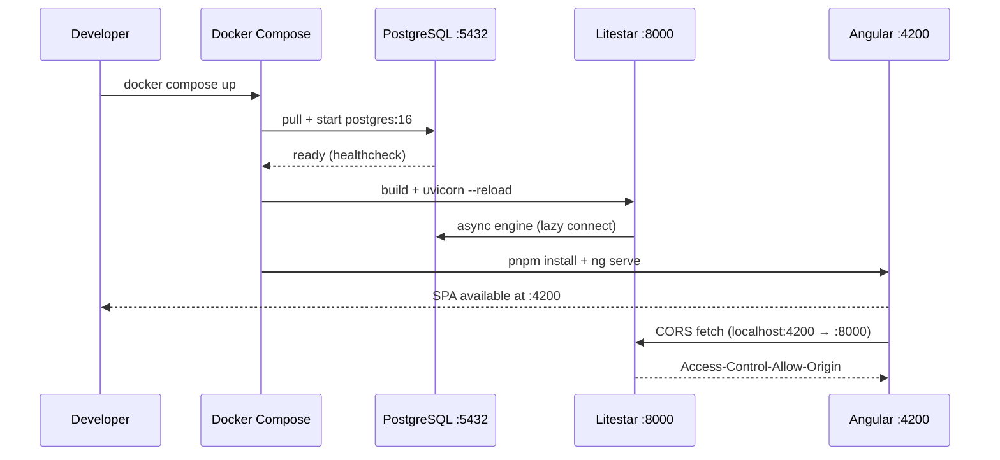

# Design: Proyecto Setup — Scaffold TiendaVirtual

## Technical Approach

Initialize the empty workspace as a three-service Docker Compose dev stack: PostgreSQL 16, Litestar (hot-reload via volume mount), and Angular 22 (ng serve). Backend uses async SQLAlchemy + `pydantic-settings`; frontend uses module-based Angular with Material, Tailwind v3, and runtime i18n. No models, auth, or tests in this change — those are Change 2+.

## Architecture Decisions

| # | Choice | Alternatives | Rationale |
|---|--------|-------------|-----------|
| D1 | **Python 3.14 base image** for Docker dev container | Python 3.12-slim (PLAN.md minimum) | Host runs 3.14.5; match host to avoid venv binary mismatch. `pip install --dry-run` before committing to verify `python-jose` and `httpx-oauth` wheels exist for 3.14. Fallback: use `python:3.12-slim` if dry-run fails. |
| D2 | **Docker volume mounts for hot-reload** (not `watch` mode) | Docker Compose `watch` (v2.27+) | Volume mounts are universally compatible with Docker Compose v3 format used by v5. `watch` mode requires Compose file format v2.27+ and adds configuration complexity. Hot-reload achieved via `uvicorn --reload` and `ng serve` watching source. |
| D3 | **Alembic `--async` template** | Custom `env.py` with `run_async` | `alembic init migrations --async` generates the official async template with `run_async_engine_migrations` pattern. Available since Alembic 1.13. Avoids maintaining custom env.py boilerplate. `alembic.ini` points `sqlalchemy.url` to `app.config.Settings().DATABASE_URL`. |
| D4 | **NgModule architecture** for Angular (not standalone) | Standalone component API (Angular 15+) | PLAN.md explicitly assumes `SharedModule` for Material re-exports and module-based lazy loading. Modules provide cleaner DI scoping for the feature-based routing in later changes. |
| D5 | **Tailwind v3 pinned** (`tailwindcss@3`) | Tailwind v4 CSS-first config | PLAN.md assumes `tailwind.config.js`. v4 replaces JS config with CSS `@theme` directives — incompatible with PLAN approach. v3 has mature Angular integration docs. Migration to v4 is explicitly deferred per proposal. |
| D6 | **ngx-translate v17 with HTTP loader** for runtime i18n | Angular built-in `$localize` (compile-time) | PLAN requires runtime language switching without rebuild. ngx-translate lazy-loads JSON from `assets/i18n/` and supports hot `use()` calls. Three languages: `es` (default), `en`, `sv`. |
| D7 | **`.env` at project root** for local secrets | Docker Compose `env_file:` only | `pydantic-settings` auto-discovers `.env`. Docker Compose reads it via `env_file: .env` on the backend service. Single source of truth. Excluded by `.gitignore`. |

## File Structure

| File | Action | Role |
|------|--------|------|
| `docker-compose.yml` | Create | Three services: `postgres` (image `postgres:16`, named volume `pgdata`), `backend` (build `./backend`, volume mount `./backend:/app`, port 8000), `frontend` (image `node:24-slim`, volume mount `./frontend:/app`, port 4200) |
| `.gitignore` | Create | Excludes `.env`, `uploads/`, `__pycache__/`, `*.pyc`, `node_modules/`, `.venv/`, `.angular/`, `dist/` |
| `README.md` | Create | Project name, stack table, prerequisites (Docker, Node 24+, Python 3.14+), `docker compose up` instructions |
| `backend/pyproject.toml` | Create | PEP 621 project config with dependencies: `litestar`, `sqlalchemy[asyncio]`, `asyncpg`, `alembic`, `pydantic-settings`, `uvicorn` |
| `backend/app/__init__.py` | Create | Empty package init |
| `backend/app/main.py` | Create | Litestar app: CORS (`allow_origins=["http://localhost:4200"]`), OpenAPI at `/schema`, health endpoint `GET /health → {"status":"ok"}` |
| `backend/app/config.py` | Create | `Settings(BaseSettings)` with `model_config = SettingsConfigDict(env_file=".env")`. Fields: `DATABASE_URL`, `DEBUG`, `SECRET_KEY`, `CORS_ORIGINS` |
| `backend/app/db/__init__.py` | Create | Empty package init |
| `backend/app/db/engine.py` | Create | `create_async_engine(url, echo=DEBUG)` + `async_sessionmaker` factory |
| `backend/app/db/base.py` | Create | `class Base(DeclarativeBase): pass` — parent for all models (Change 2+) |
| `backend/alembic.ini` | Create | Generated by `alembic init migrations --async`, then edited: `sqlalchemy.url` → reads from Python config |
| `backend/migrations/` | Create | Alembic migrations directory (env.py, versions/, script.py.mako) |
| `frontend/` (Angular CLI) | Create | `ng new frontend --routing --style=scss` using `@angular/build` builder |
| `frontend/src/app/app.config.ts` | Create | Register `provideHttpClient()`, `provideAnimations()`, `provideRouter(routes)`, `TranslateModule` config |
| `frontend/src/app/shared/shared.module.ts` | Create | Re-exports: `MatButtonModule`, `MatToolbarModule`, `MatIconModule`, `MatSidenavModule`, `MatListModule` |
| `frontend/src/app/layout/header/` | Create | Header with app title + language selector (ngx-translate) |
| `frontend/src/app/layout/footer/` | Create | Simple footer with copyright |
| `frontend/src/app/features/home/` | Create | Placeholder home view |
| `frontend/src/assets/i18n/{es,en,sv}.json` | Create | Minimal translation files (`{"header.title":"La Tiendita",...}`) |
| `frontend/tailwind.config.js` | Create | Content paths: `./src/**/*.{html,ts}`, `@tailwind` directives in `styles.scss` |

## Testing Strategy

| Layer | Status | Rationale |
|-------|--------|-----------|
| Backend unit/integration | **Deferred to Change 2** | No models, services, or controllers exist yet. `strict_tdd: false` in config. |
| Frontend unit/e2e | **Deferred to Change 2** | Angular CLI generates `*.spec.ts` stubs but they test nothing. Jasmine/Karma runner not yet configured in CI. |

## Migration / Rollout

No migration required — this is the initial scaffold. Rollback: `rm -rf` all created files, `docker compose down -v` to remove volumes.

## Open Questions

- [ ] Verify `python-jose` and `httpx-oauth` install cleanly on Python 3.14 before committing Dockerfile base image. If they fail, switch to `python:3.12-slim`.
- [ ] Confirm `@angular/material@22` and `tailwindcss@3` PostCSS plugin do not conflict during `ng build`. Manual `postcss.config.js` may be needed.
